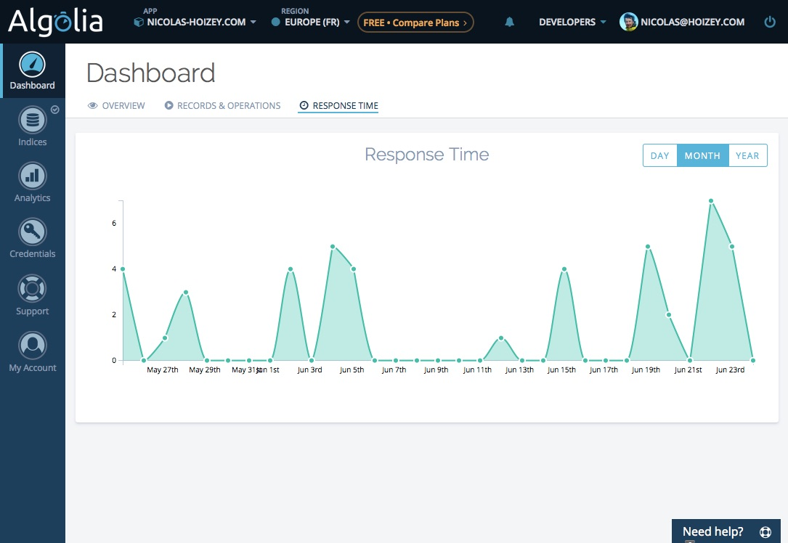

Un des soucis avec un site statique tel que celui-ci, c'est que par définition il rend compliquée la mise en œuvre de fonctionnalités habituellement dynamiques. Les commentaires viennent immédiatement à l'esprit, et seront évoqués ultérieurement, mais la mise en place d'un moteur de recherche interne n'est pas plus simple. Heureusement, Algolia est là.

{.logo }

Avant de découvrir les pistes envisagées et ce que j'aime dans Algolia, [allez donc tester par vous-même](/search/) et/ou regardez ce petit screencast fait pour l'occasion :



Pour proposer des résultats à une recherche comme ceci, il faut nécessairement faire du dynamique, trouver des éléments répondant aux critères de recherche et les lister.

Avec un site dynamique, il est possible d'indexer directement les contenus présents dans le dépôt de contenus, en général une base de données. Certains CMS intègrent même directement cette fonctionnalité, plus ou moins clef en main.

Avec un site statique, il existe trois possibilités :

# Un moteur de recherche côté serveur

{.logo }

Ce n'est pas parce que le site est statique qu'il est impossible de déployer une solution dynamique côté serveur, telle que [Solr](http://lucene.apache.org/solr/), « à côté » des pages.

Sauf que cela réduit fortement la portabilité du site, gagnée grâce à la nature statique, et complexifie l'hébergement en nécessitant une plateforme plus technique.

# Un moteur de recherche côté client en JavaScript intégré au site

Il est sinon possible de mettre en place une recherche intégralement côté client, donc en JavaScript, comme avec [Lunr](http://lunrjs.com/) par exemple.

Cela peut-être assez riche fonctionnement, mais le risque porte vite sur la performance quand le volume de contenus augmente. L'utilisateur doit télécharger tout les contenus avant de pouvoir y trouver des éléments correspondant à la recherche, et cette recherche est d'autant plus lente que le volume augmente.

# Un moteur de recherche côté client en mode SaaS

Il est enfin possible de s'appuyer sur une solution tierce disponible intégralement en ligne, en mode SaaS.

## Google Custom Search

Il existe bien entendu [Google Custom Search Engine](https://developers.google.com/custom-search/docs/overview), la solution gratuite de Google[^gss] permettant de profiter d'une recherche complète avec la puissance que l'on connaît :



[^gss]: Il existe aussi la solution [Google Site Search](https://www.google.com/work/search/products/gss.html), qui elle est payante.

Mais cette solution est plutôt pénible à configurer, à intégrer, et vraiment pas satisfaisant en termes de design et UX. [J'ai essayé](https://cse.google.com/cse/publicurl?cx=013671593275354155634:byyvkk_5xf0), et y ai perdu pas mal d'heures avant d'abandonner.

De plus, l'indexation est plein texte, sans vraiment de paramétrage possible, comme pour le Google Search général. La qualité du code _front end_ du site a un impact déterminant sur la mise en œuvre.

## Algolia

{.logo }

C'est alors que j'ai entendu parler[^vvo] d'[Algolia](https://www.algolia.com/), un moteur de recherche en mode SaaS intégralement pilotable par une [API REST](https://www.algolia.com/doc/rest_api) extrêmement riche, et pour laquelle de [très nombreux clients](https://www.algolia.com/doc/apiclients) et [intégrations](https://www.algolia.com/doc/integrations) sont déjà proposés de base.

[^vvo]: Merci [Vincent](https://twitter.com/zeroload), qui y travaille depuis quelque temps et a notamment participé à la [refonte de l'excellente bibliothèque cliente en JavaScript](https://blog.algolia.com/modern-javascript-libraries-the-isomorphic-way/).

Algolia est bluffant à plus d'un titre :

* API REST riche et simple à exploiter grâce aux clients clefs en main, que ce soit pour l'indexation ou la recherche
* [documentation](https://www.algolia.com/doc/getting-started) super complète et assistant la mise en œuvre pas à pas
* qualité fonctionnelle et ergonomique de l'interface d'administration
* nombreux paramètres de configuration activables dans l'interface et surchargeables via l'API
* et enfin, performance incroyable, avec des temps de réponse extrêmement faibles permettant une expérience utilisateur optimale, que ce soit en mode [suggestion de recherche](https://www.algolia.com/doc/tutorials/auto-complete) ou [résultats instantanés](https://www.algolia.com/doc/tutorials/instant-search)

[Ma mise en œuvre](https://github.com/nhoizey/nicolas-hoizey.com/blob/master/search.njk) n'est sans doute pas parfaite techniquement, mais j'y suis arrivé assez simplement grâce aux tutoriels proposés et à l'aide rapide et efficace obtenue via Twitter en cas de blocage, donc c'est à la portée de tout le monde !

## Mais… et si mon site est dynamique, ou si je n'ai pas JS côté client ?

Bien entendu, rien ne vous empêche d'utiliser Algolia même si votre site n'est pas statique, il y a sans doute plein de belles choses à faire avec, comme le montrent [les nombreuses références de la solution](https://www.algolia.com/customers).

Rien ne vous empêche non plus d'interagir avec l'API avec une autre techno que JavaScript, notamment pour gérer un fallback côté serveur en cas de [JavaScript non disponible pour une raison ou une autre](http://christianheilmann.com/2011/12/06/that-javascript-not-available-case/), mais cela n'est vraiment plus applicable à un site statique.

Pour ma part, j'ai mis un fallback vers Google, faute de pouvoir restreindre la recherche à mon site avec DuckDuckGo[^ddg].

[^ddg]: Si quelqu'un sait comment faire, ça m'intéresse…

## D'accord, mais tant de magie a forcément un coût !

Évidemment, « tout travail mérite salaire », comme on dit. Donc si vous commencez à utiliser sérieusement Algolia, [il faudra payer](https://www.algolia.com/pricing).

Mais si vous utilisez Algolia pour un projet open source ou non commercial —comme moi ici—, vous pouvez demander à [l'utiliser gratuitement](https://www.algolia.com/doc/faq#?category=subscription-and-payments&item=473648940) !
