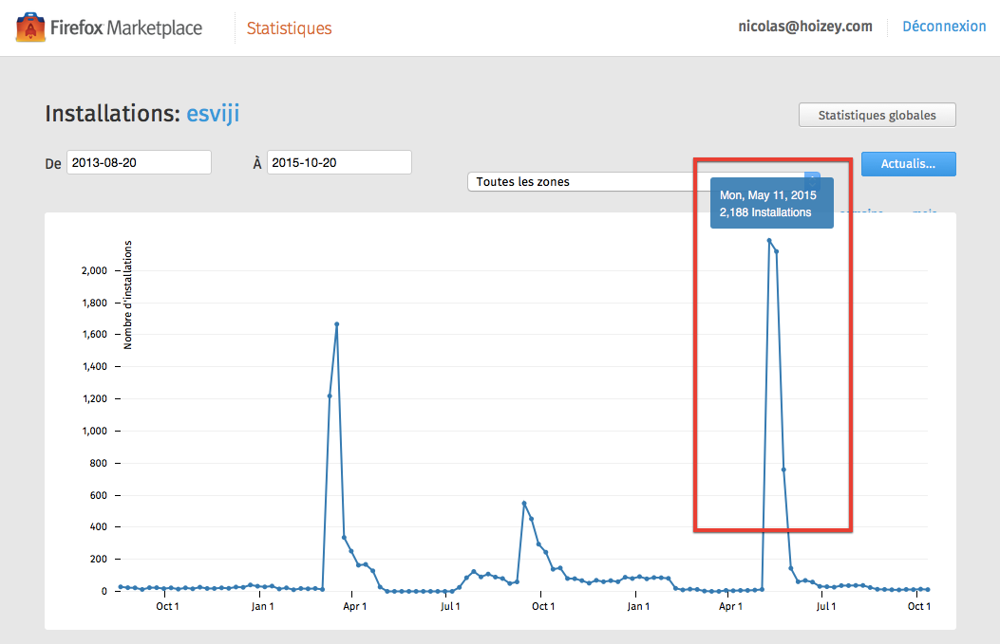

Mon jeu [esviji](http://esviji.com) est principalement utilisé sur les smartphones Firefox OS — à 75% d'après Google Analytics — grâce à sa [présence dans la marketplace qui leur est dédiée](https://marketplace.firefox.com/app/esviji), et plutôt apprécié [visiblement](https://marketplace.firefox.com/app/esviji/ratings).

Voilà les 10 versions de Firefox les plus utilisées sur [play.esviji.com](http://play.esviji.com/)[^v2] depuis 3 mois, et les versions de Firefox OS correspondantes[^corr] :

[^v2]: N'oubliez pas que vous pouvez maintenant aller tester la version sur [v2.esviji.com](http://v2.esviji.com/) !

[^corr]: Les correspondances sont données par [cette table](https://developer.mozilla.org/en-US/docs/Web/HTTP/Gecko_user_agent_string_reference#Firefox_OS_version_number).

|--------------------+-----------------------+----------|
| Version de Firefox | Version de Firefox OS | Sessions |
|-------------------:|----------------------:|---------:|
|               28.1 |                   1.3 |    8 354 |
|               18.1 |                   1.1 |    1 254 |
|               28.0 |                   1.3 |      489 |
|               32.0 |                   2.0 |      122 |
|               18.0 |                 1.0.1 |       19 |
|               37.0 |                   2.2 |       13 |
|               34.0 |                   2.1 |        9 |
|               26.0 |                   1.2 |        3 |
|               30.0 |                   1.4 |        2 |
|               39.0 |                   2.? |        1 |
|--------------------+-----------------------+----------|

La version 1.3 de Firefox OS est donc largement la plus utilisée parmi les joueurs de esviji, qui se trouvent principalement aux Philippines, et la vieille version 1.1 est encore pas mal présente.

Je dois donc prendre en compte ces deux versions dans mes tests pour savoir si elles sont compatibles avec les nombreuses nouveautés CSS[^css] employées dans la future version 2 de esviji. Sinon, elles devront se contenter de rester sur la v1.

[^css]: Notamment les *viewport units* (`vw`, `vh`, `vmin` et `vmax`), `calc()`, et flexbox.

En parlant de statistiques, je serais **énormément heureux** si quelqu'un peut m'expliquer d'où vient cet énorme sursaut dans les installations de esviji durant trois jours à partir du 11 mai 2015 :

