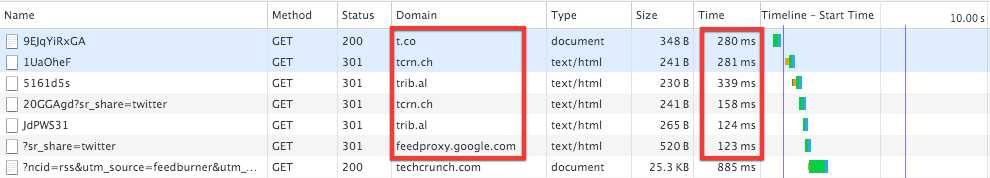
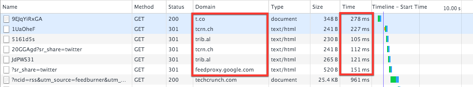

Les raccourcisseurs d'URL sont devenus incontournables sur le Web depuis quelques années, mais initialement pensés comme outils de facilitation de partage[^nhoio], [ils ont beaucoup évolué](http://www.lemonde.fr/technologies/article/2009/12/15/la-bataille-des-raccourcisseurs-d-adresses-web_1281072_651865.html) et sont surtout devenus des outils de _tracking_. Du coup, les sites en abusent de plus en plus, alors que les plateformes où ces liens sont publiés, Twitter par exemple, rajoutent leur propre couche. **L'impact sur la performance pour l'utilisateur final est désastreux**.

[^nhoio]: J'utilise moi-même le domaine personnalisé `nho.io` avec Bitly quand j'ai besoin de partager une URL courte et intelligible, notamment des [permashortlinks](https://indiewebcamp.com/permashortlinks) vers mes propres contenus, mais j'en connais les conséquences, donc je suis prudent.

Voici l'exemple d'un lien présent dans un tweet de TechCrunch :

https://twitter.com/TechCrunch/status/700559714762018816

L'URL où se trouve effectivement le contenu est [http://techcrunch.com/2016/02/18/google-opens-its-cloud-vision-api-to-all-developers/](http://techcrunch.com/2016/02/18/google-opens-its-cloud-vision-api-to-all-developers/).

Mais la première URL effectivement suivie est celle imposée par Twitter, c'est à dire [https://t.co/9EJqYiRxGA](https://t.co/9EJqYiRxGA), même si l'URL affichée dans le tweet — qui fera l'objet de la première redirection — est [http://tcrn.ch/1UaOheF](http://tcrn.ch/1UaOheF).

Et voilà l'enchainement de redirections provoqué par un clic sur ce lien :

Le cumul des temps passés pour chaque redirection avant d'arriver à la « vraie » requête pour la page voulue est de 1 300 millisecondes, **presque une seconde et demi de perdue** !

Et cela dans un environnement bien confortable avec une connexion fibre de très bonne qualité.

La simulation d'une bonne connexion 3G dans Chrome montre que la bande passante du réseau n'a aucune influence sur ce temps passé, puisqu'aucun contenu n'est en fait transféré :

La simulation d'une latence de 500 millisecondes sur cette connexion 3G — ce qui peut se produire très souvent en mobilité — montre par contre un impact énorme :

Le temps perdu est ici de 3 370 millisecondes, soit **presque 3 secondes et demi** !

Autant dire que c'est extrêmement frustrant, et qu'il m'arrive souvent de revenir à mon fil Twitter avant que la page souhaitée n'ait été affichée.

Dans le cas qui illustre mon propos, on peut se demander de plus pourquoi on fait un double aller-retour entre `tcrn.ch` et `trib.al`, il y a peut-être une erreur de configuration quelque part, avec en conséquence une seconde de vraiment perdue pour rien.
