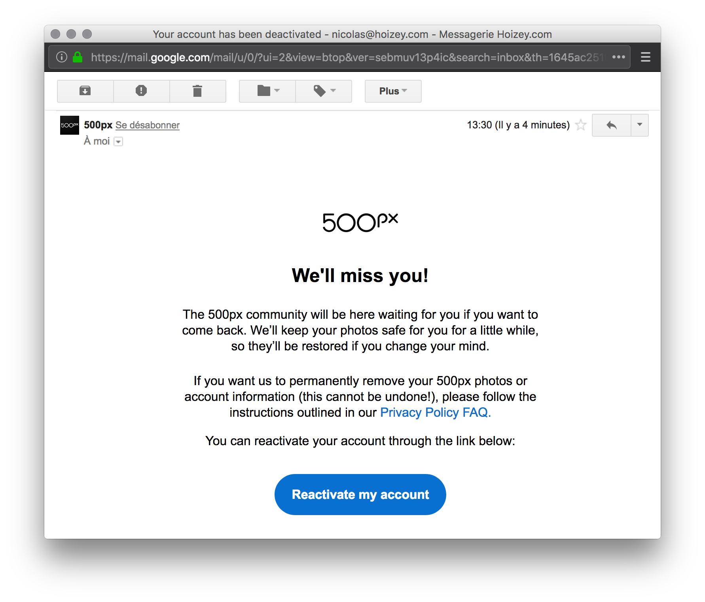

500px once was a light in the dark, when Flickr stopped evolving, years ago. But 500px gradually descended from its pedestal, as decisions were made against users' interests.

# A fast growing challenger

{.logo}

When Flickr was bought by Yahoo, and then evolved into a family photography sharing service instead of the virtual home for passionate photographers, 500px came with a new gorgeous design, giving more space to photos. As [I wrote back in 2015 (in french)](https://phototrend.fr/2015/02/attrait-flickr-face-a-500px/):

> 500px photos clearly have more of an artistic vocation (we may not like portraits that are often too retouched, or landscapes that are a bit too HDRized, but that's not the point) than those from Flickr, which has become a completely generalist, purely utilitarian repository of images.

500px was lacking a few of Flickr's awesome features at the beginning, but they evolved quickly to add what was missing the most.

## Groups

[Groups](https://500px.com/groups) were among these features, but never really got the audience of Flickr ones, it seems. This is an area where UX should be prioritized over visual design, which 500px clearly didn't understand.

## Collections

Collections were another nice feature of Flickr, even if they limited the number of photos we could put in them.

I asked 500px for this several times:

https://twitter.com/nhoizey/status/639690058107355137

And they did it after a while: [Galleries: An Exciting New Way to Use and Experience 500px](https://iso.500px.com/galleries-release/)

Unfortunately, 500px soon removed the action of favoriting a photograph, migrated the existing favorites into a more difficult to use "favorites" gallery, and later changed the behavior of likes, messing with our habits.

It is still impossible to list our likes, making them useless appart from the "Pulse" dance, and requiring us to use galleries instead, with much more steps.

# But a lot of issues

## Arbitrary photo crops

In the beginning, 500px had real issues with arbitrary photo crops in several pages, which made me mad:

https://twitter.com/nhoizey/status/629179061621932032

How could a service dedicated to good photography take so little care of something so important?

https://twitter.com/nhoizey/status/672193180251660288

https://twitter.com/nhoizey/status/608303851809161217

They finally [changed the design of galleries](https://iso.500px.com/introducing-the-new-500px-experience/), and started preserve photos ratios.

## Search

500px also has issues with search, that is not always relevant enough to be useful:

https://twitter.com/nhoizey/status/727254218223026176

## Web and iPhone don't have the same UX

In today's omnichannel world, it's really annoying seing a pure player like 500px provide desynchronized experiences on the Web and the mobile app (at least [the iOS one](https://iso.500px.com/the-new-500px-for-ios-the-best-way-to-experience-500px-on-a-mobile-device/)).

The app is easy to use, helps adding photos to galleries with a smart mix of latest used galleries and then alphabetical sort (just like Pinterest), while the website keeps all galleries in last use order, up to the very last one, which really doesn't work well when you have a lot of galleries.

Additionally, buttons colors (for likes for example) sometimes have opposite meanings between the mobile app and the website.

A mess…

## Money, money, money

500px has also always been a little too pushy for subscriptions, showing banner even when I got 2 years of subscription in advance:

https://twitter.com/nhoizey/status/580067068894150656

500px also launched Prime, a marketplace allowing photographers to sell their creations, but with [a really low 30% cut of the selling price](https://www.dpreview.com/articles/8278377858/500px-launches-a-licensing-marketplace-with-30-cut-for-photographers). A real shame. 500px later changed it to a better share, but everyone remembers how it started.

## Click highjacking

500px thought it was a good idea to adopt a more Single Page App architecture, with traditional links replaced with JavaScript event handlers, but didn't to it in an accessible way, preventing users to open some links in another browser tab (at least [in Firefox](https://bugzilla.mozilla.org/show_bug.cgi?id=1204440), my favourite browser):

https://twitter.com/nhoizey/status/651443318098907136

# The REALLY bad

## No more RSS

One of the thing I hate the most is that 500px removed a powerful feature I was using a lot for serendipity and photographers discovery: the RSS feeds for galleries:

https://twitter.com/nhoizey/status/414541544549801984

I use RSS (or Atom) feeds a lot, for example on Flickr, and 500px ones where perfect. I never got a clear answer when I asked why they removed them.

## Transitioning from a passionate photographers project to a soulless business

500px creators have already <del>left</del> been ousted a while ago ([Oleg Gutsol](https://thenextweb.com/entrepreneur/2015/05/23/co-founder-ex-ceo-500px-trial-errors-lessons-learned/) in 2014 and [Evgeny Tchebotarev](https://twitter.com/tchebotarev/status/1012537794894237696) in 2016), but it got worse with [the recent acquisition by Visual China Group (VCG)](https://iso.500px.com/vcg-acquisition-announcement/), the world's third-largest visual content provider, a company that has been called the "Getty Images of China".

## No more Creative Commons licenses

All of my photos are shared online with [a Creative Commons license](https://creativecommons.org/licenses/by-nc-sa/4.0/) allowing people to adapt them freely as long as they share them with attribution, and don't use them for commercial purposes.

But [500px will no longer allow photographers to license their photos under Creative Commons](https://www.theverge.com/2018/7/1/17521456/500px-marketplace-creative-commons-getty-images-visual-china-group-photography-open-access).

I don't want to give 500px more power over my photos, so I have to leave.

Hello Flickr, happy to see [SmugMug freed you from Yahoo](https://www.smugmug.com/together/), [I'm back](https://flickr.com/photos/nicolas-hoizey/)!
