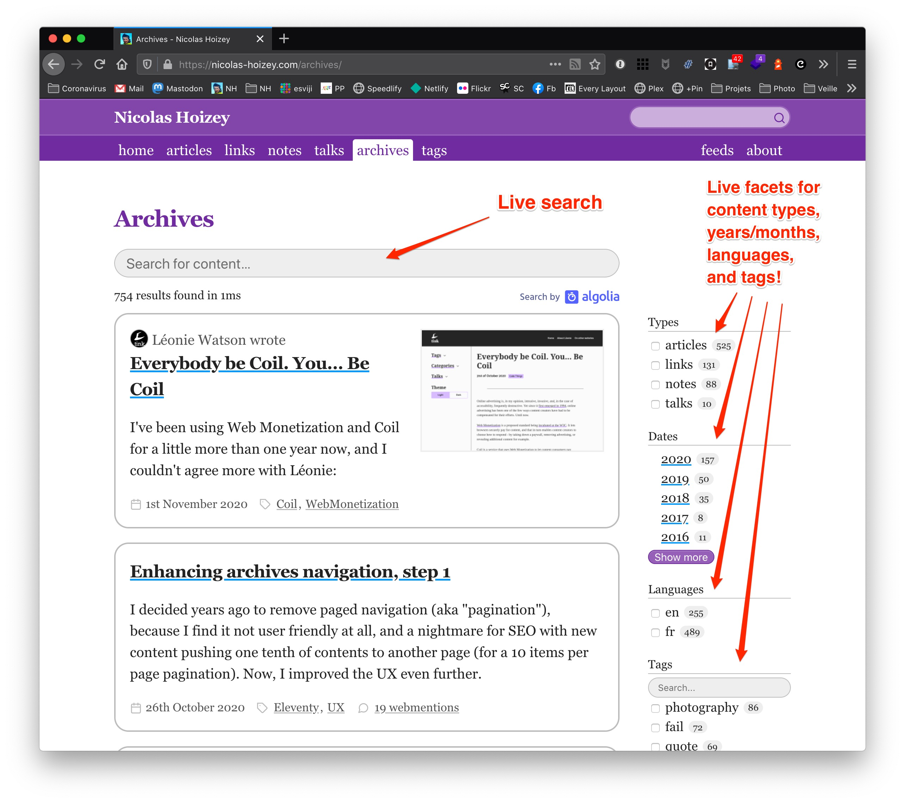
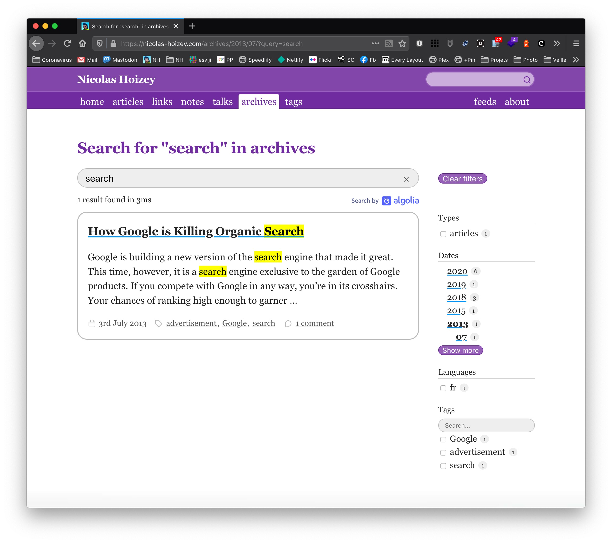

In my previous article [Enhancing archives navigation, step 1](), I promised further archives navigation enhancements. Here they are!

Remember how UX of navigation in archives by year and month where already enhanced with [a single Eleventy layout](https://github.com/nhoizey/nicolas-hoizey.com/blob/master/src/_layouts/archives.njk):

::: warning
This new awesome layout made my build time go from 40 seconds to 300 seconds, a 650 % increase, not so awesome… 😅
:::

Now, imagine you want to see content from two — or more — types ([articles and notes](/archives/?type=articles&type=notes) for example), or mix not only one type and a date, but also the language, or tags, even multiple of them.

Generating all possible filter combination as static pages with one single Eleventy build would probably take more than one hour. I obviously don't want that, even if this would provide users with an even better UX.

Time to [enhance the already nice server-side rendering with awesome client-side features]()!

Here's what is now available for navigating the archives, [if you activated JavaScript](https://kryogenix.org/code/browser/everyonehasjs.html) in your browser:

There is a search input field, to search for any content, with live "as you type" results, and live updated filtering facets. 🤯

If you search for something specific, the results highlight why they're here in the list:

{.logo}
All of this would not be possible without [Algolia](/tags/algolia/), the awesome search service I've been using for multiple years.

I inject all my contents in an Algolia index, and a single JavaScript script uses [Algolia's InstantSearch.js UI library](https://www.algolia.com/doc/guides/building-search-ui/what-is-instantsearch/js/) to build the user interface and synchronize the search term and facets values to the URL (and back).

What I really like here is that this is not the only way to browse the archives, it is "only" a (great) enhancement of what's available to anyone with the server-side rendering.

I hope you'll enjoy this new feature!
