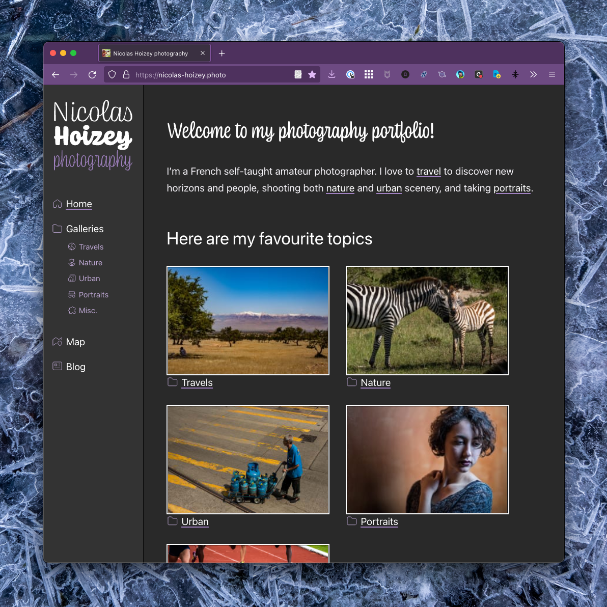
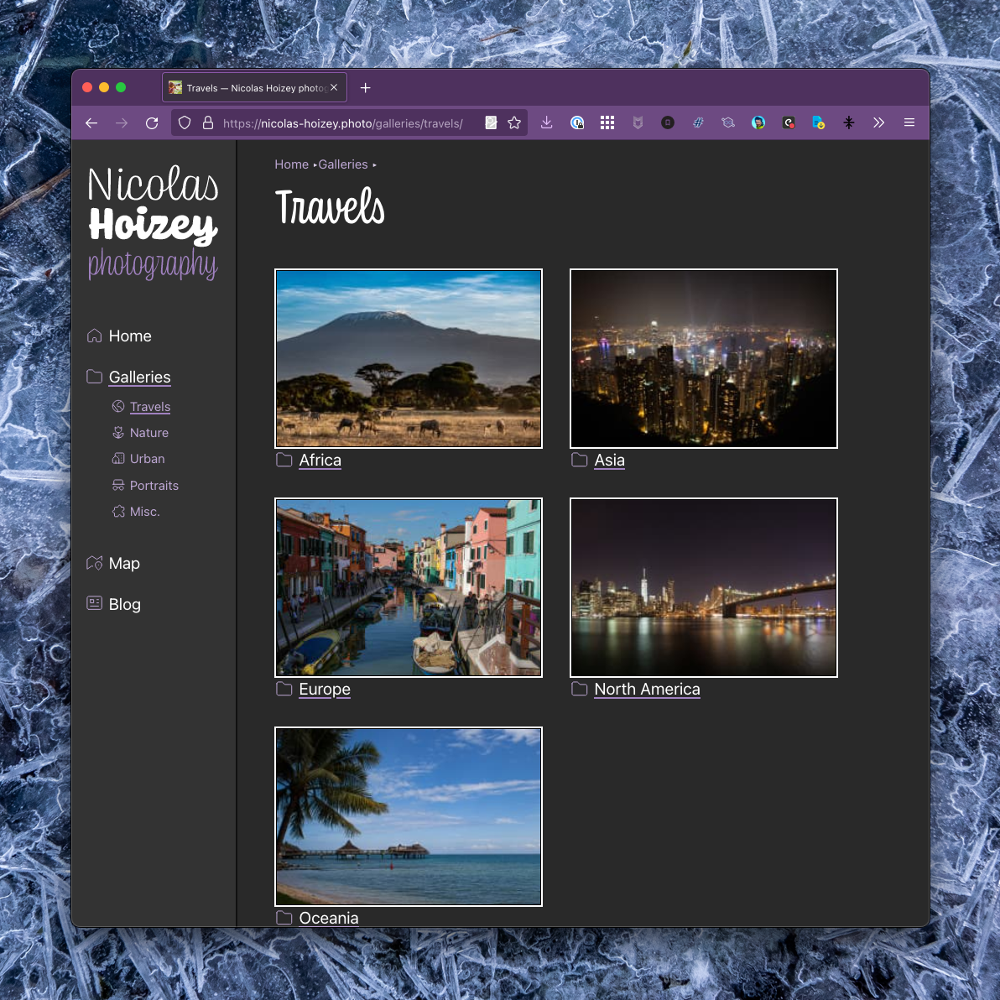
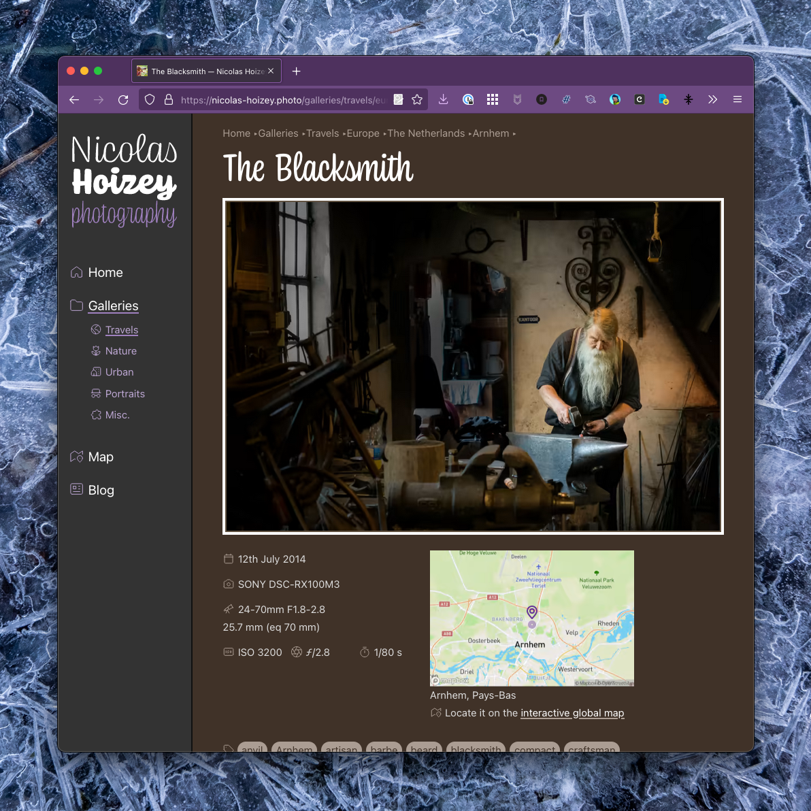
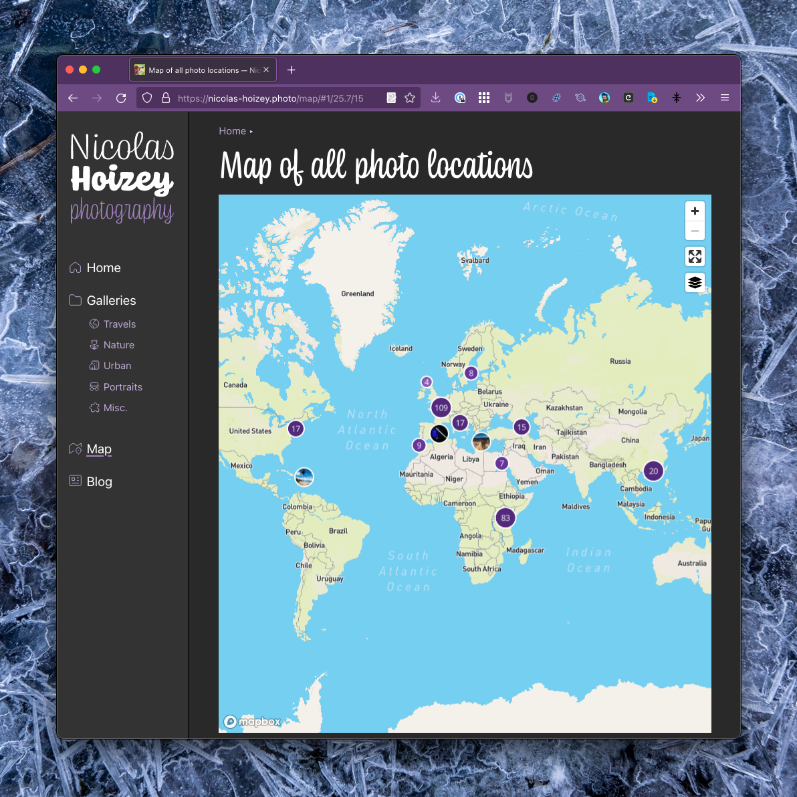
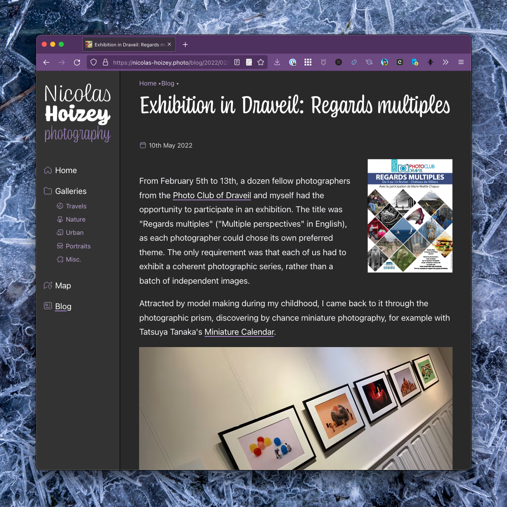

::: lead
I've been disliking for a long time that Instagram is a closed platform, more so in the hands of Facebook.

I additionally now really dislike that they are [doing everything to resemble TikTok](https://www.newstatesman.com/science-tech/2021/07/instagram-pivot-video-tiktok-mosseri-reels-marks-end-social-media-we-know-it), by [prioritizing video more and more, at the expense of photography](https://www.washingtonpost.com/technology/2021/07/02/instagram-tiktok-videos/).
:::

As a result, I'm going to stay on it for now, but only keep following people I really know and like. I will find inspiration and share my own creations in a much more enjoyable way on welcoming platforms like [Flickr](https://www.flickr.com/photos/nicolas-hoizey/) and [Pixelfed](https://pixelfed.social/nhoizey)[^pixelfed].

[^pixelfed]: [Pixelfed](https://pixelfed.org/) is kind of the (few) good parts of Instagram, with the many good part of Mastodon. Here's a [beginner's guide to Pixelfed](https://write.wien.rocks/paula/beginners-guide-to-pixelfed).

If you want to follow my photography work, I invite you to come directly to **my own website**: [nicolas-hoizey.photo](https://nicolas-hoizey.photo!).

Here are a few screenshot of the experience you can expect, tailored to my needs and your viewing pleasure:

Enjoy [the visit](https://nicolas-hoizey.photo/)!
