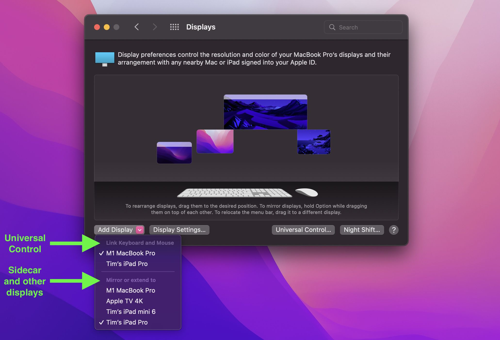

::: lead
I really have some trouble remembering which features Apple provide — as well as their names — to perform a task with the displays of multiple Apple devices. So here's a list, for me at least, but it might be useful for others.
:::

I will try to keep it short, and provide links to know more about the features and how to use them.

# Airplay

A bit of history:
- In 2004, Apple introduced AirTunes in iTunes 4.6, allowing to stream music from iTunes on a Mac to an [AirPort Express](https://en.wikipedia.org/wiki/AirPort_Express) device, plugged to speakers or other audio devices.
- In 2010, Apple then introduced AirPlay in iOS 4.2, to stream both audio and video from an iPhone, iPad or iPod Touch to an Apple TV.
- In 2012, with OS X Mountain Lion 10.8, Apple allowed to also use AirPlay on a Mac, to stream the sound of the computer, not just the one from iTunes.
- Then in 2018, Apple releases AirPlay 2 on iOS 11.4.
- And finaly, the most important for this article, Apple adds in macOS Monterey 12 the capability for Mac computers to receive an AirPlay stream.

So yes, a Mac computer can now both send and receive a video and audio stream, so **any compatible Mac display can be used to extend another Mac's display**.

My work computer is a MacBook Air M2, on which I can plug [only one external display](https://support.apple.com/guide/macbook-air/use-an-external-display-apd8cdd74f57/mac). Enough most of the time. But when I'm home, I can extend the display to my personal MacStudio's display! **Having three displays to organize the many windows I need when I'm doing development is really handy**.

## Requirements

Using an Apple device as an AirPlay sender requires:
- On an iPhone, iPad, iPod Touch, or Apple TV:
  - iOS 4.2+ for AirPlay
  - iOS/iPadOS/tvOS 11.4 for AirPlay 2
- On a Mac: OS X Moutain Lion 10.8+

Using an Apple Mac or iPad as an AirPlay receiver requires:
- On an Apple TV: iOS/tvOS 4.2+
- On a Mac: macOS Monterey

## Links

- Apple's marketing page: [AirPlay](https://www.apple.com/airplay/)
- Wikipedia: [AirPlay](https://en.wikipedia.org/wiki/AirPlay)

# Sidecar

Sidecar allows **using an iPad as a secondary display for a Mac**.

It's like if the iPad was an AirPlay receiver, but with additional features. For example, you can use the Apple Pencil on Mac applications shown on the iPad.

When I'm traveling, I sometimes use my iPad mini as a second monitor for my work MacBook Air, thanks to Sidecar.

## Requirements

Sidecar requires:
- OS versions
  - iPadOS 13+
  - macOS Catalina 10.15+
- All devices
  - Connected to the same iCloud account
  - Positioned within 10 meters (30 feet) of each other

## Links

- Apple's support documentation: [Use an iPad as a second display for a Mac](https://support.apple.com/en-us/102597)
- MacRumors' guide: [Sidecar: Turn an iPad Into a Secondary Mac Display](https://www.macrumors.com/guide/sidecar/)

# Universal Control

**Universal Control allows multiple Macs and iPads to be controlled with a single mouse and keyboard**.

Here's Apple's Craig Federighi showing Universal Control with a MacBook, an iPad and an iMac:

<iframe src="https://share.newsroom.apple/newsroom/embed/videos/?embedvideoid=16c6216cd7013aa33917b5a16d78839a" width="1280" height="720" title="Universal Control Demo Video" allowfullscreen></iframe>

I use it at home every time I'm working from home, using the keyboard and trackpad of my work MacBook Air to also control my personal MacStudio, and sometimes even my iPad mini, when I don't use them as extended displays with AirPlay/Sidecar.

With Universal Control, I can even copy a file from one computer to another just by drag-and-dropping it from one display to the other.

It really feels magical.

And a great news is that [you can use both Sidecar and Universal Control at the same time](https://www.macrumors.com/2022/03/15/universal-control-sidecar-work-same-time-macos/)!

## Requirements

Universal Control requires:
- OS versions
  - iPadOS 15.4+
  - macOS Monterey 12.4+
- Devices connected to the same Apple ID account
- Devices positioned within 10 meters (30 feet) of each other

## Links

- Apple's support documentation: [Universal Control: Use a single keyboard and mouse between Mac and iPad](https://support.apple.com/en-us/102459)
- MacRumors' guide: [How to Set Up Universal Control Between Mac and iPad](https://www.macrumors.com/how-to/set-up-universal-control-mac-ipad/)

# Continuity

AirPlay to Mac, Sidecar and Universal Control are part of a larger family of features provided by Apple: [Continuity](https://www.apple.com/macos/continuity/).
