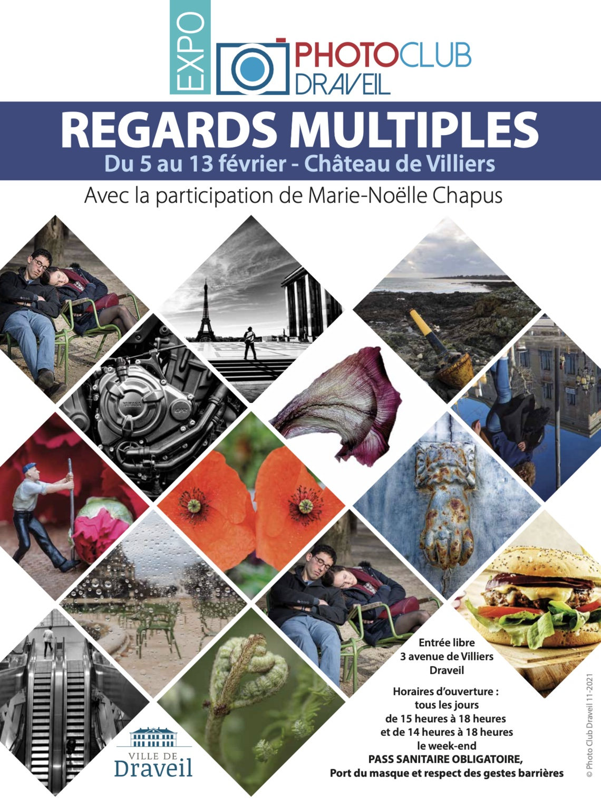

Maintenant que mes photos sont enfin prêtes, j'ai hâte que commence l'exposition « Regards multiples » de mon Photo Club à Draveil.

Une de mes photos [déjà connue](https://nicolas-hoizey.photo/galleries/misc/miniature/the-flowering-of-the-carnations/) se trouve sur cette affiche :

{.twothirds}

Mais elle ne sera finalement pas exposée ! 😅

Elle est bien dans le thème que j'ai choisi, des saynète[^scenette] avec figurines miniatures, mais elle n'étant pas pertinente dans la série finale.

[^scenette]: Je viens d'apprendre que [« scénette » n'existe pas](https://www.projet-voltaire.fr/regles-orthographe/scenette-ou-saynete/) !

Je conserve l'exclusivité des nouvelles photos pour l'exposition, puisque je les ai imaginées et réalisées dans cet objectif. Donc **venez les voir** en situation ! Bon, au pire, si vous êtes trop loin… ou flemmard… elles seront prochainement en ligne sur [mon site photo](https://nicolas-hoizey.photo/).
