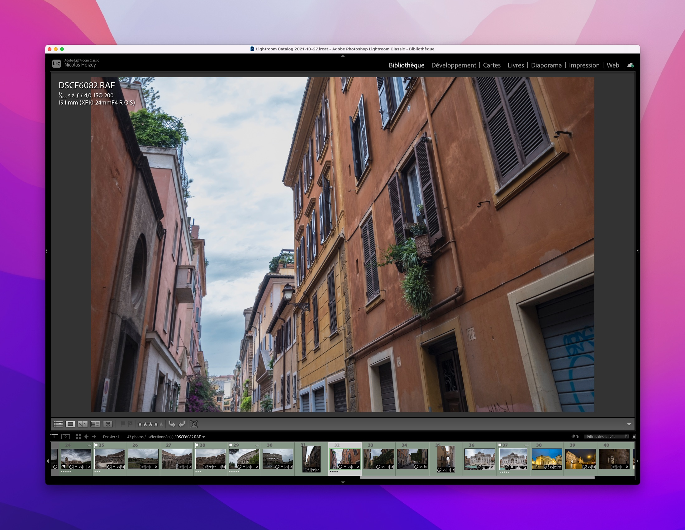
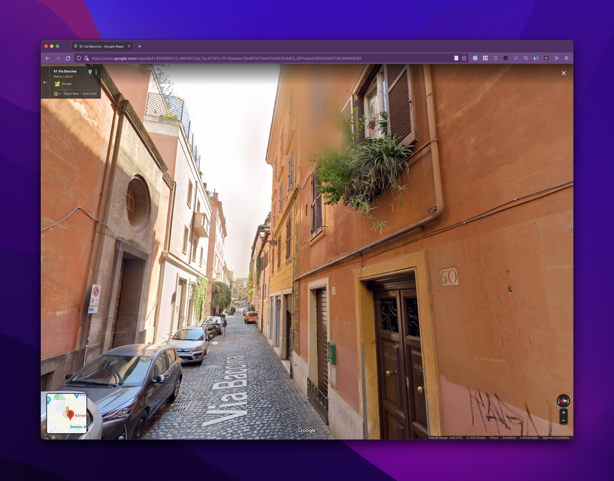
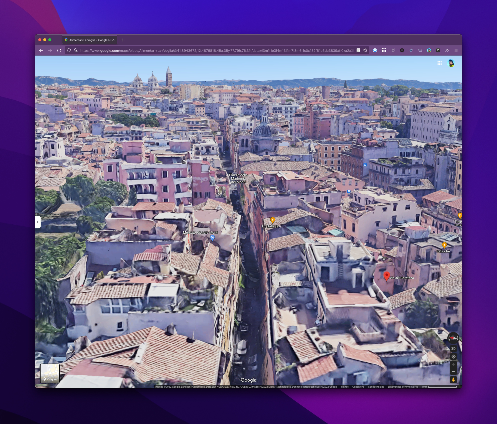

J'ai beau essayer de toujours penser à mettre en route ce qu'il me faut pour géolocaliser mes [photos de voyages](https://nicolas-hoizey.photo/galleries/travels/), j'oublie parfois. Et là, c'est le drame. 😭

{.twothirds}

Ou pas ! Merci beaucoup à Google Maps, et surtout [Street View](https://www.google.com/maps/@41.8945964,12.4891817,3a,75y,87.97h,101.3t/data=!3m6!1e1!3m4!1sV4A2fobiE0_GP1oQo5VR5Q!2e0!7i16384!8i8192) et la vue 3D, avec lesquels j'arrive souvent à retrouver un lieu précis de prise de vue, ce qui me permet de mettre à jour la photo dans Lightroom.

{.twothirds}

{.twothirds}

Du coup, vous pouvez maintenant [aller voir la photo et son emplacement géographique](https://nicolas-hoizey.photo/galleries/travels/europe/italy/rome/warm-colors-of-rome/) ! 🗺

*NB : C'est marrant comme la récupération automatique d'une photo prise un même jour peut donner un résultat pas forcément pertinent par rapport au sujet dont je vais parler… 😅*

