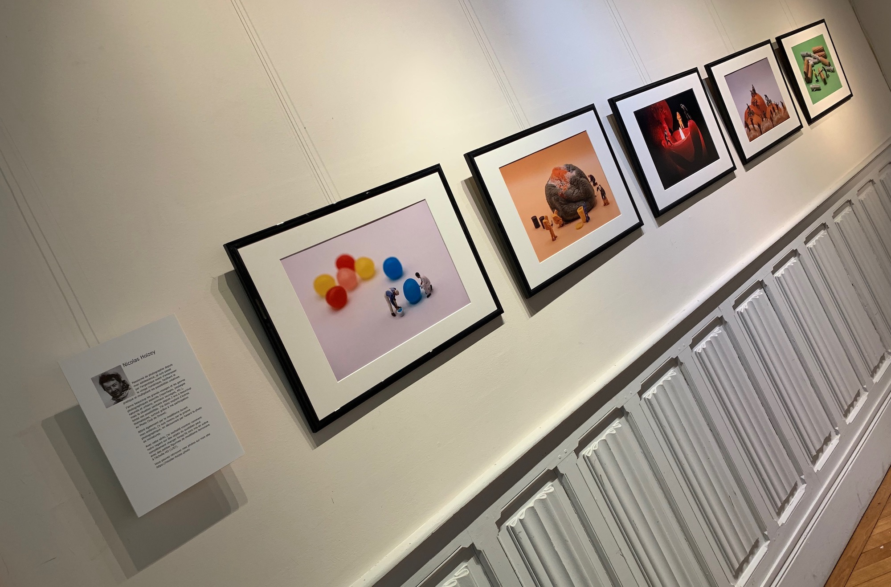

Karl [partage](https://www.la-grange.net/2022/02/16/photo) une vidéo impressionnante de motorisation d'une voiture à l'échelle 1/87 (on dit "HO" chez les pros du modélisme ferroviaire) :

https://www.youtube.com/watch?v=-vxaDFuZ44g

C'est incroyable ce qu'on arrive à faire avec du talent et des outils adaptés… 😍

De mon côté, je pratique aussi l'échelle HO (non, pas « à chaud »), mais sans le côté bricolage, comme vous avez pu le voir avec [ma participation à la dernière exposition du Photo Club de Draveil](https://nicolas-hoizey.photo/blog/2022/02/16/exhibition-in-draveil-regards-multiples/)

¨
