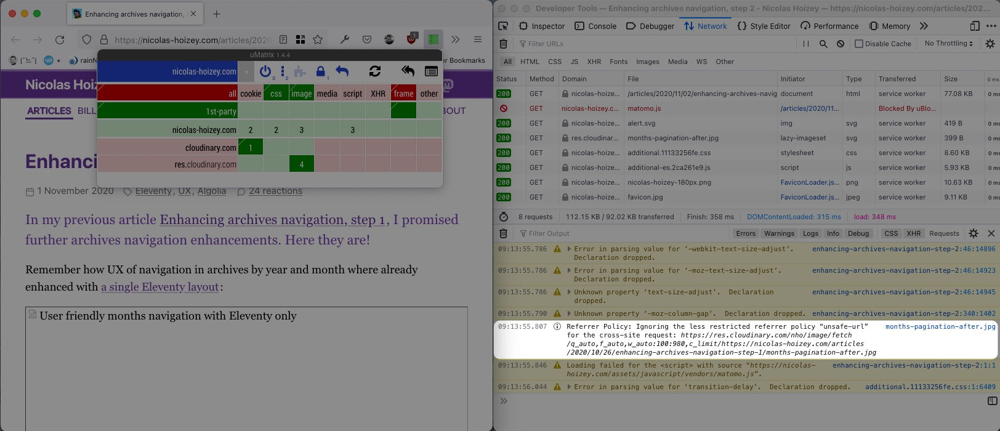

Bon sang, [Karl ne voit pas mes images](https://www.la-grange.net/2022/02/24/interrogatoire) ! 😱

Après différents tests dans Chrome 99.0.4844.51[^version] et Firefox 98.0[^beta], je constate que j'arrive à avoir le même comportement dans Firefox avec µMatrix (que je découvre) et sa configuration par défaut, et un rechargement de page sans cache[^macos] permet d'afficher les images. Le test est « réussi » plusieurs fois.

[^version]: Ils pourraient améliorer leurs numéros de versions… 🤷‍♂️

[^beta]: Oui, je suis sur la version *beta*.

[^macos]: Avec <keybd>Command</keybd> + <keybd>Shift</keybd> + <keybd>R</keybd> sur mon Mac.

Mais après avoir désactivé puis réactivé µMatrix, je n'ai plus le problème… Arrêt/relance de Firefox, désinstallation/réinstallation de µMatrix, désinstallation/réinstallation du Service Worker, rien n'y fait, je n'arrive plus à reproduire le souci de Karl, que j'ai aussi constaté temporairement. 😭

Sur la copie d'écran de Karl, je vois un message particulier :



> Referrer Policy: Ignoring the less restricted referrer policy "unsafe-url" for the cross-site request: <https://res.cloudinary.com/nho/image/fetch/q_auto,f_auto,w_auto:100:980,c_limit/https://nicolas-hoizey.com/articles/2020/10/26/enhancing-archives-navigation-step-1/months-pagination-after.jpg>

J'ai effectivement un [en-tête HTTP `Referrer-Policy`](https://developer.mozilla.org/en-US/docs/Web/HTTP/Headers/Referrer-Policy)[^mdn] dans [mon `.htaccess` pour Apache](https://github.com/nhoizey/nicolas-hoizey.com/blob/3c517cc9a5a68372a817504ad0de18528fd46af4/src/.htaccess#L420-L428) :

[^mdn]: Je n'arrive décidément pas à me faire à ce [redesign sans âme de MDN](https://hacks.mozilla.org/2022/03/a-new-year-a-new-mdn/)… 😞

```apacheconf
<IfModule mod_headers.c>
  Header set Referrer-Policy "unsafe-url"
</IfModule>
```

De mon côté, j'ai un message (en français) avec plus d'en-têtes concernées :

> Stratégie de référent : les stratégies les moins restrictives, comprenant « no-referrer-when-downgrade », « origin-when-cross-origin » et « unsafe-url » seront bientôt ignorées pour la requête intersite : <https://res.cloudinary.com/nho/image/fetch/q_auto,f_auto,w_auto:100:980,c_limit/https://nicolas-hoizey.com/articles/2020/10/26/enhancing-archives-navigation-step-1/months-pagination-after.jpg>

Mon message dit « seront bientôt ignorées », mais cela de Karl dit "Ignoring", donc je suppose qu'il est en avance sur moi en termes de version de Firefox (en *nightly* peut-être ?), avec déjà l'application de cette règle.

Je constate par ailleurs que ce (vieux) site utilise la valeur `unsafe-url` alors que mes nouveaux sites utilisent plutôt la valeur `no-referrer-when-downgrade` plus restrictive. Il est temps de changer.

Mais bon, cela ne résoudra pas le problème de Karl, il ne s'agit que de maîtriser quelles informations sont envoyées à d'autres sites, ici Cloudinary.

Pourquoi l'image ne se charge-t-elle parfois pas ? Le mystère reste pour l'instant entier… 🕵️
