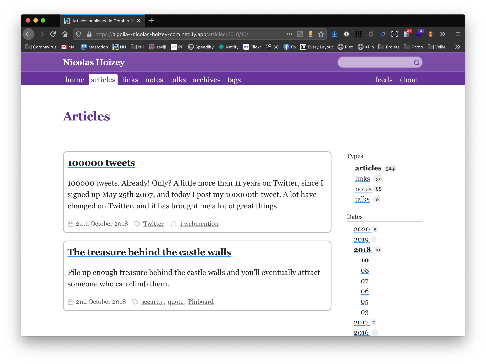

I decided years ago to remove paged navigation (aka "pagination"), because I find it not user friendly at all, and a nightmare for SEO with new content pushing one tenth of contents to another page (for a 10 items per page pagination). Now, I tried to improve the UX even further.

