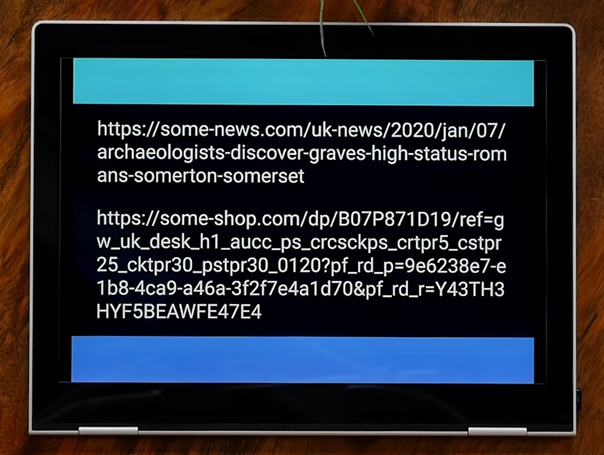
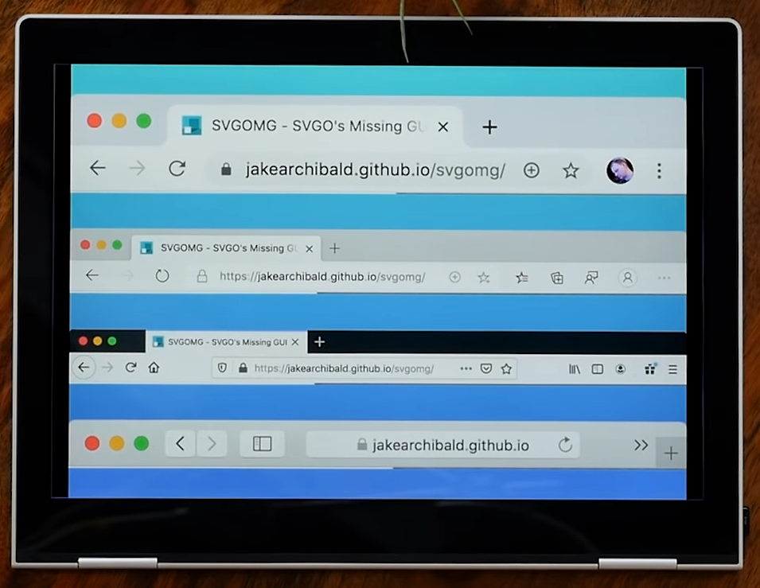
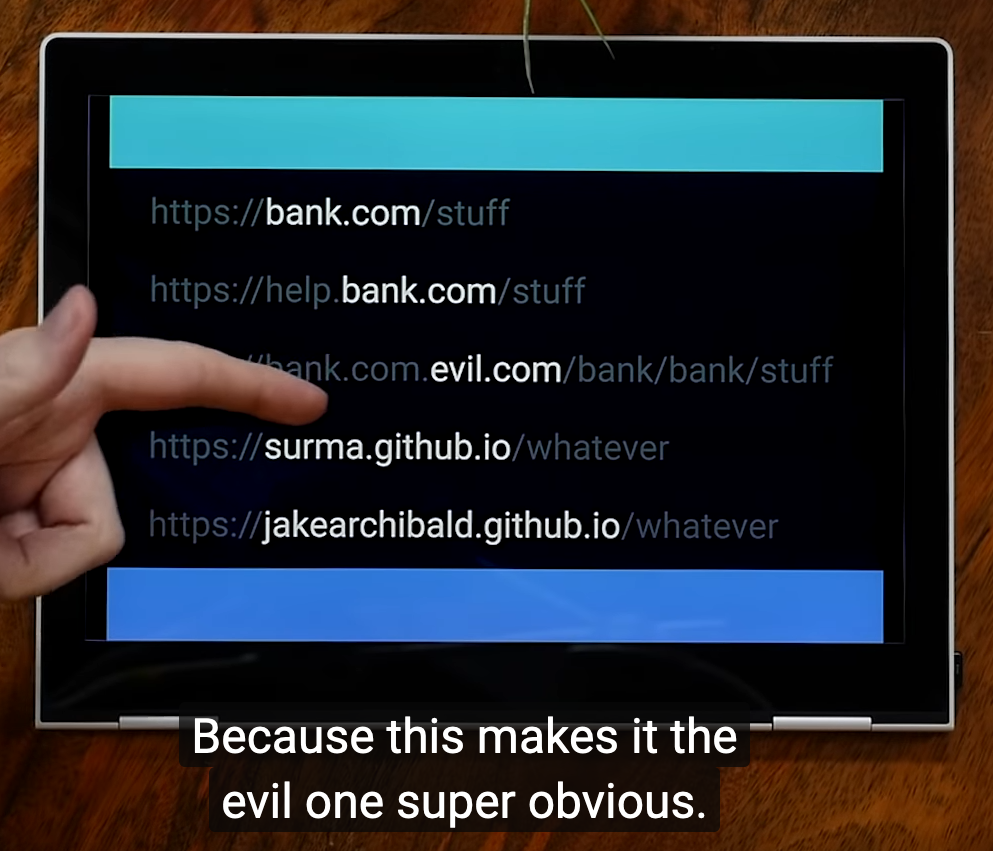
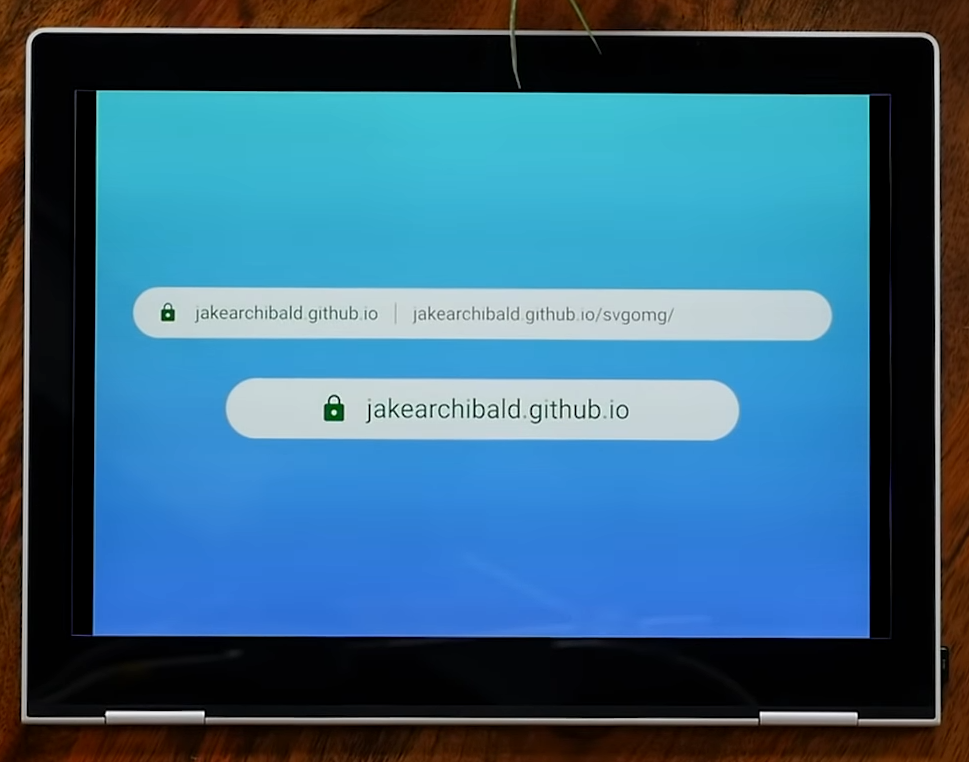

Jake leads this HTTP 203[^http203] episode with his reflexions about current URL display practice in browsers, and how it could be improved, at least for security.

[^http203]: [HTTP 203](https://www.youtube.com/playlist?list=PLNYkxOF6rcIAKIQFsNbV0JDws_G_bnNo9) is a great show where « Google Developers Jake Archibald and Surma discuss their philosophies about web development and the various aspects of it, meanwhile dropping in lifehacks, lessons and some honest truths ».

For advanced Web users like me, the request part of the URL helps locate current page in the site, if there's a nice logic in the URL[^urllogic]:

[^urllogic]: Like I try on this site… 😉

Safari unfortunately hides this request part, even on desktop:

For users with no technical knowledge about the URL structure, being able to detect fishing attempts immediately would be a huge security improvement:

That's why I really like what Jake suggests, as it makes the eTLD+1 obvious for security, but keeps the full URL alongside it, if there's enough space:

One thing Jake and Surma didn't talk about through, is how this [Public Suffix List](https://publicsuffix.org/) Mozilla maintains can grow without hurting browsers' performance, like with the [HSTS Preload list](https://scotthelme.co.uk/hsts-preloading/#butitdoesntscale).
