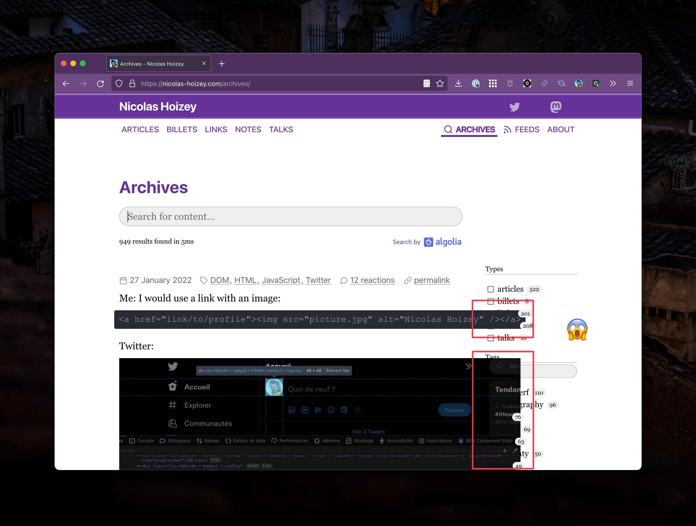

> Sometimes, while building a component, you suddenly notice a weird horizontal scroll bar. You keep trying and fixing the wrong thing, only to realize later that the cause is something else. How many times have you been there?

I don't know how many times, but it just happened today! Well, I saw it today, but I fear it's been there for a while.

On my [archives page](/archives/), the list of contents was overlaping the search filters when there was a long `<pre>` element:

Fortunately, I quickly found Ahmad's post about this behavior of CSS Grid where "the minimum content size of a grid item is `auto`, [which] means a grid item can expand its width due to long content".

After [adding a simple `min-width: 0` to the overlaping Grid item](https://github.com/nhoizey/nicolas-hoizey.com/commit/be6a039224facc6c9bec8d6b3b890799c815352b), it was fixed! 🎉

Thanks a lot Ahmad for sharing this!
