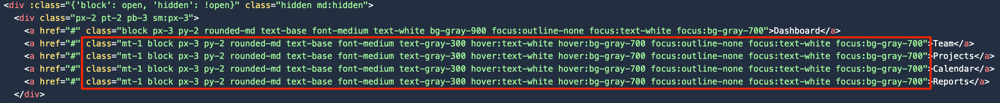

I know some utility classes can be useful, and #Tailwind helps some devs create pages without (really) knowing #CSS, but is it enough to justify [this logorrhea in our HTML](https://tailwindui.com/preview)?

