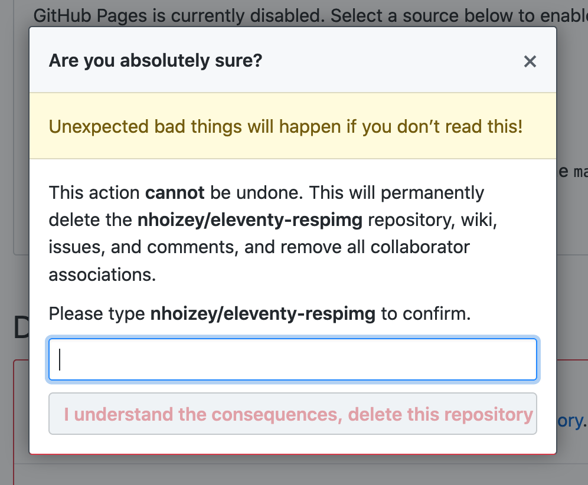

I wish #GitHub had a different UX for repository deletion if this is a fork.

Especially if there is nothing useful (no open PR for example) on the repository to delete. "Unexpected bad things" will NOT happen in such case!

(sorry @etportis ;-) )
