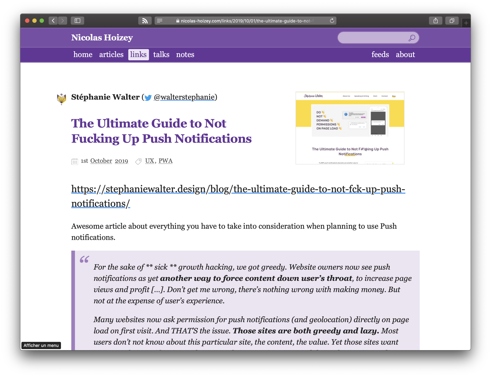
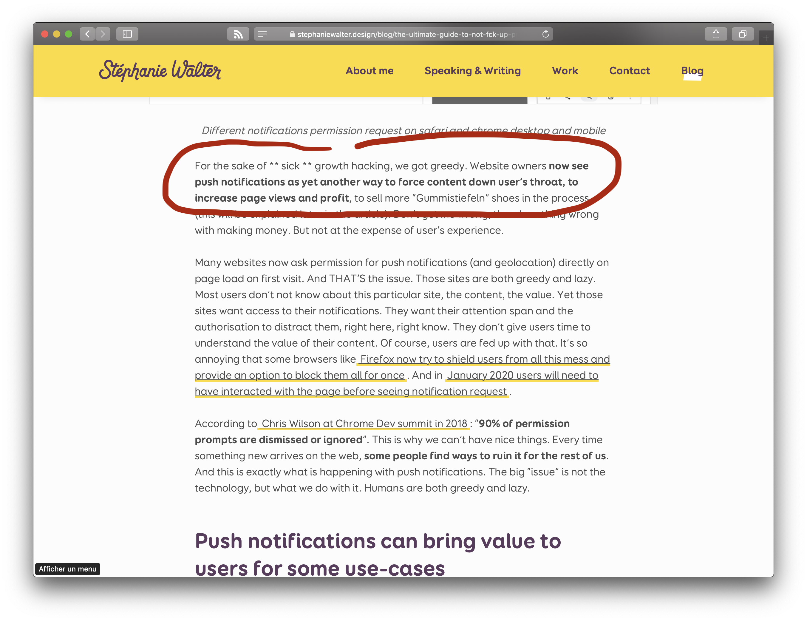

I used to use a `<strong>` emphasis (`**` with Markdown) in the quotes I put in my [links](/links/).

But when [the source content](https://stephaniewalter.design/blog/the-ultimate-guide-to-not-fck-up-push-notifications/) (👋 @WalterStephanie) uses the same emphasis, there's an issue.

So I followed [David's lead](https://larlet.fr/david/2020/02/21/#surlignage) and now use `<mark>` instead.

