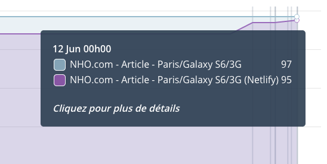

I'm trying to get at least the same #Dareboost score for my site with #Netlify as with #AlwaysData, but it looks like it won't be possible… 😥

https://community.netlify.com/t/setting-response-headers-only-on-documents/6144

