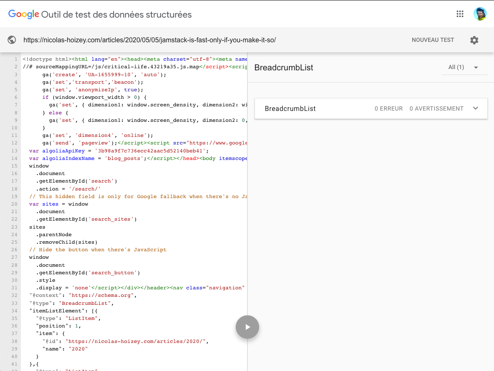
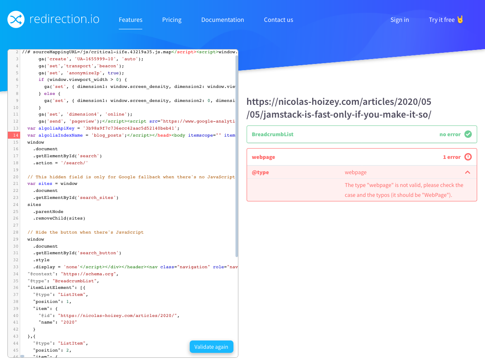
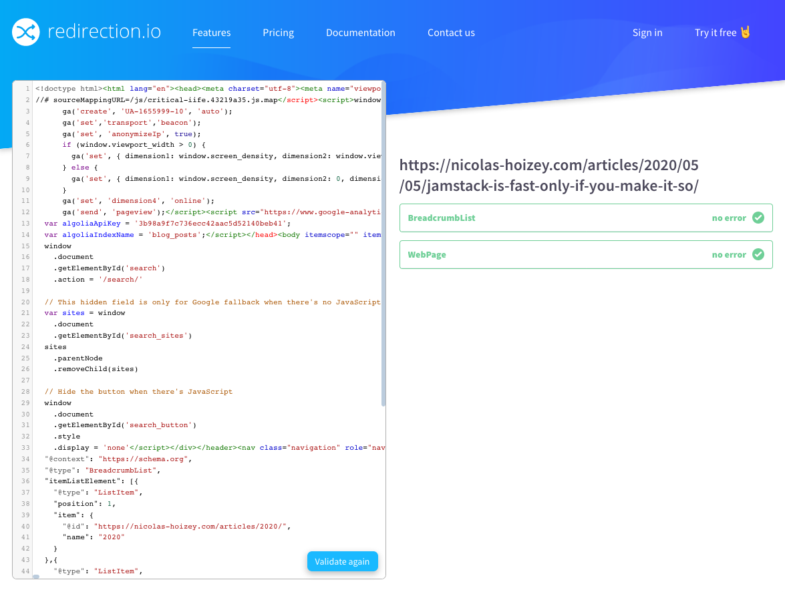

Google's Structure Data testing tool finds only the [BreadcrumbList](https://schema.org/BreadcrumbList) type in my article pages.

But using @redirectionio's new [Structured data validation tool](https://redirection.io/tools/structured-data), I've been able to fix an issue with a second type, [WebPage](https://schema.org/WebPage), that Google didn't see. 👍

