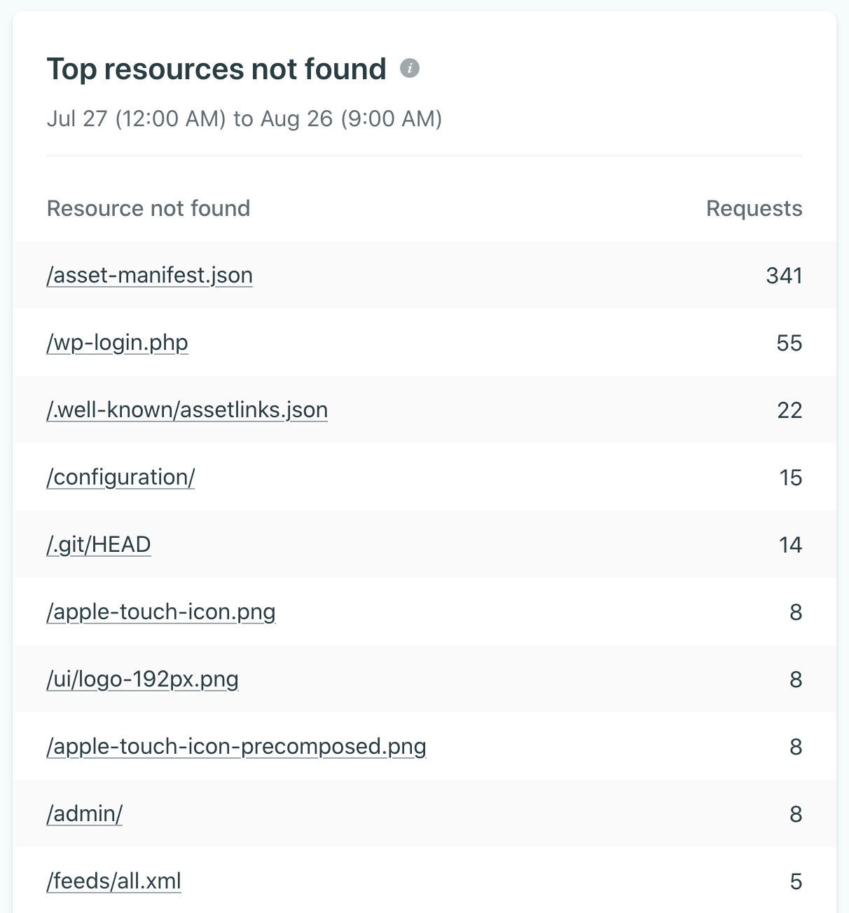

According to #Netlify Analytics, here are the top 10 requests made on [Pack11ty](https://pack11ty.dev/) that give a 404 error.

Some are obvious, others less.

Is there any public list of sources for such requests?
