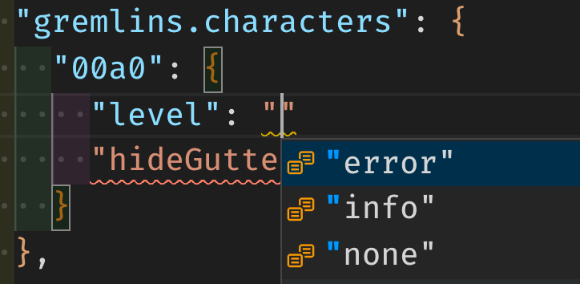

[Gremlins tracker](https://marketplace.visualstudio.com/items?itemName=nhoizey.gremlins) for #VSCode v0.25.0 is there!

You can now configure a character as perfectly acceptable, it will not show a gremlin anymore. 👻

Settings also now have IntelliSense for the available values! 🎉

