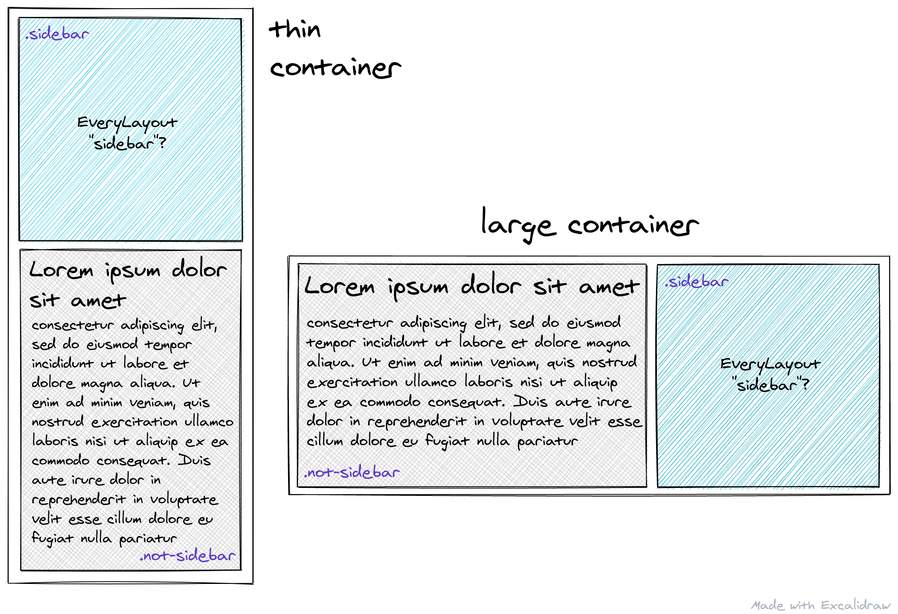

I wonder if #EveryLayout's sidebar could be used for an intrinsically responsive media component where the image is on the top by default, and on the right when there's enough space. 🤔

Looks like it's either first element on the left or last element on the right…

