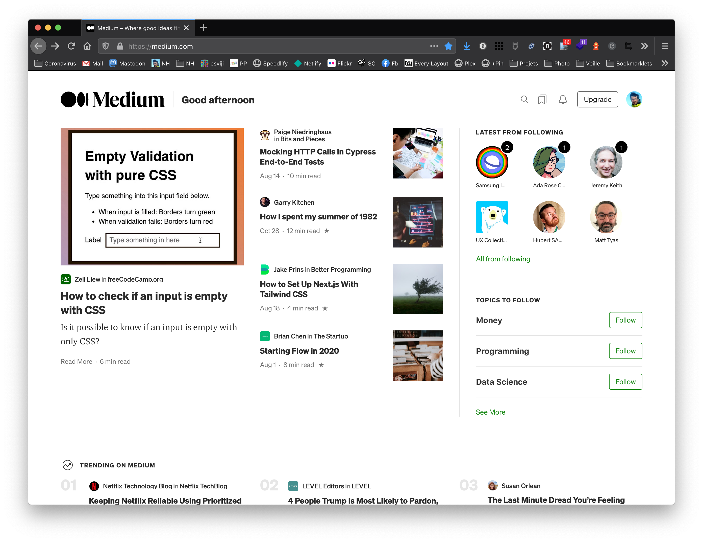

Based on my reading history, #Medium pushes [five](https://blog.bitsrc.io/https-blog-bitsrc-io-how-to-perform-web-scraping-using-node-js-5a96203cb7cb) [articles](https://levelup.gitconnected.com/how-to-scrape-any-website-and-build-an-api-using-cheerio-js-6a3f0c651d2e) [about](https://blog.bitsrc.io/web-scraping-with-puppeteer-e73e5fee7474) [web](https://medium.com/swlh/an-introduction-to-web-scraping-with-puppeteer-3d35a51fdca0) [scrapping](https://medium.com/better-programming/scrape-the-web-with-puppeteer-in-node-js-577168831612) to my homepage.

If I'm really looking for content on this topic, I will use the search.

Use your content recommendation engine for NEW topics, outside my bubble, please! 🙏
