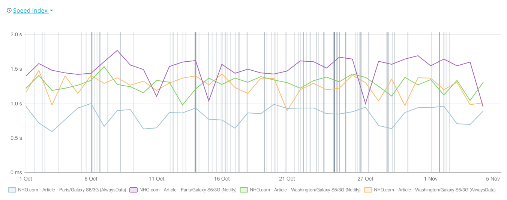

One month of #Dareboost monitoring of [an article page](https://nicolas-hoizey.com/articles/2018/08/01/using-cloudinary-s-fetch-api-to-convert-an-animated-gif-to-a-video/) on this site, hosted on #AlwaysData and #Netlify.

AlwaysData wins for France (obvious?), and it's a tie for people in the US…
