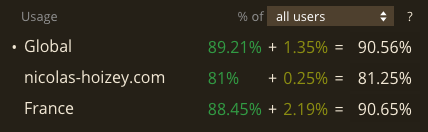

When I import my Google Analytics data in #CanIUse, it says only 80 % of my visitors have support for CSS `clamp()`, while it's 90 % globally. 🤔

I have almost only tech-savvy visitors, so I don't understand. 🤷‍♂️
