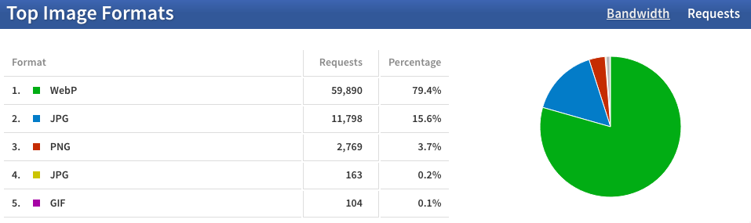
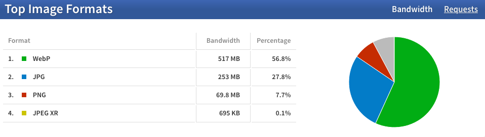

79.4 % of the requests made for images on my web sites are served as WebP by #Cloudinary:

But it only represents 56.8 % of the bandwidth!

Looking forward to seeing AVIF and JPEG XL in there… 😁

…[one year later]().
