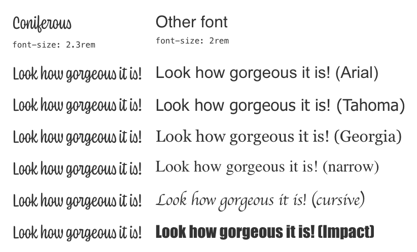

Building a new site with [the beautiful Coniferous web font](https://ohnotype.co/fonts/coniferous) from @OHnoTypeCo and I can't find the right "web safe" fallback font to be able to optimize Cumulative Layout Shifts. 😭

Any suggestion?
