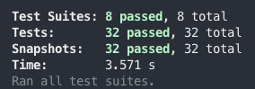

This [migration](https://github.com/nhoizey/images-responsiver/issues/138) from basicHTML to LinkeDOM in [images-responsiver](https://nhoizey.github.io/images-responsiver/) looks good! 😍

I have yet to find if [this behavior with HTML entities](https://github.com/WebReflection/linkedom/issues/71) is an issue.

+@markboulton
