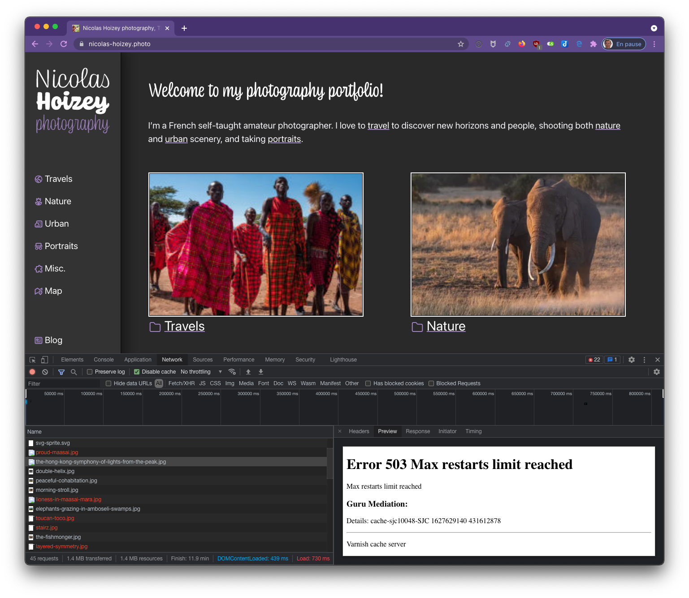

I get a lot of 503 errors from #Fastly in Chrome or Edge, not in Firefox or Safari, for image requests on <https://nicolas-hoizey.photo/> 😱

The requests go to #Netlify then #Cloudinary (here's [how](https://nicolas-hoizey.com/links/2020/11/18/proxying-cloudinary-requests-with-netlify/)), I don't know exactly where Fastly is.
