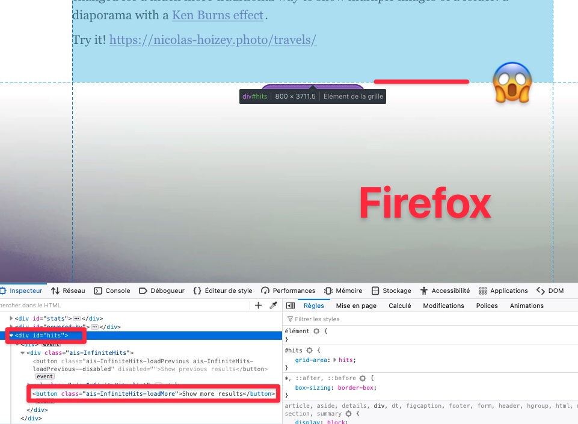
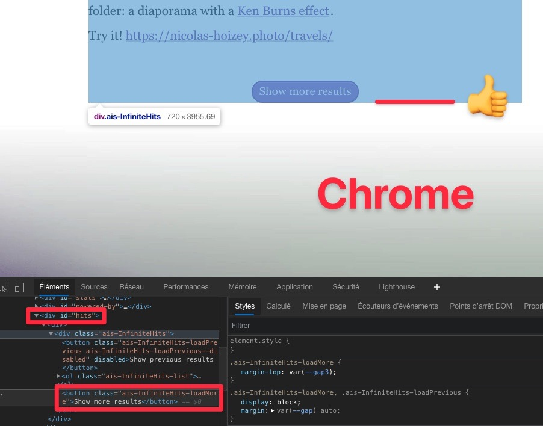

Anyone knows why in #Firefox sometimes the button in the bottom of <https://nicolas-hoizey.com/archives/> is outside its container, while everything is fine in #Chrome? 🤔

Maybe a CSS Grid issue?

{.border}

{.border}
