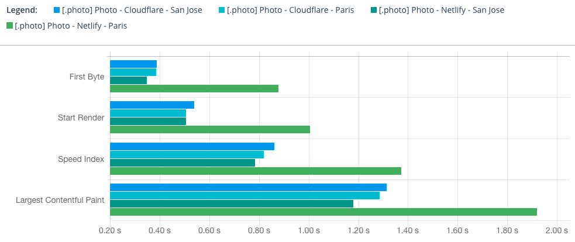
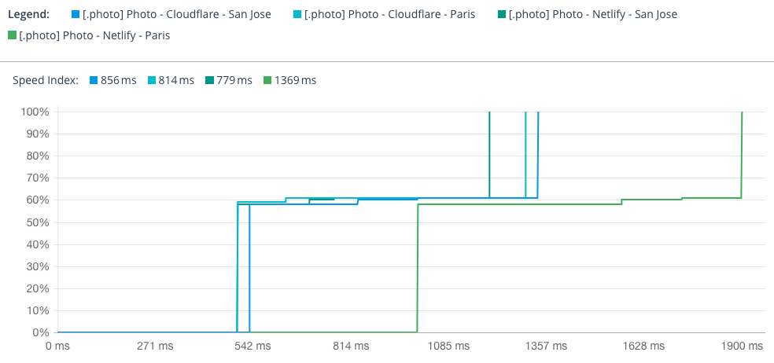

The really high TTFB from France with #Netlify makes me want to move to another hosting for [my photography site](https://nicolas-hoizey.photo), maybe #Cloudflare.

This is sad, I really like Netlify features. 😔
