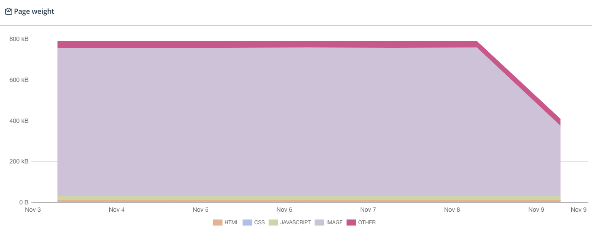

Without any visual change, [a simple config change](https://github.com/nhoizey/nicolas-hoizey.photo/commit/eedb16f13368d307a0eeed1a5de086795abdccd5) in my #Eleventy plugin [images-responsiver](https://nhoizey.github.io/images-responsiver/eleventy-plugin-images-responsiver/) improved `srcset` and `sizes` attributes of images on [my photography site](https://nicolas-hoizey.photo/) and have reduced the homepage weight by half! 🏎

