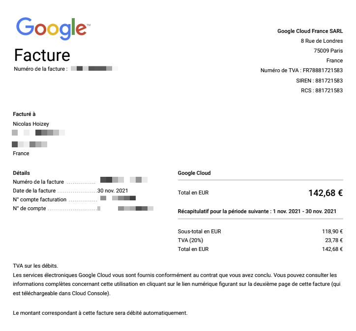

Two weeks ago, I used [Google BigQuery with HTTP Archive data](https://httparchive.org/faq#how-do-i-use-bigquery-to-write-custom-queries-over-the-data) to find [the heaviest images in French government home pages](https://annuel2.framapad.org/p/gouv-lourd-9qv6?lang=en).

Today, I received a bill I didn't anticipate… 😅

