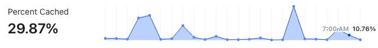

I tried to follow @TheRealNooshu advice about #Cloudflare [cache configuration for performance](https://nooshu.com/blog/2021/09/06/migrating-from-github-pages-to-cloudflare-and-netlify/#web-performance) on [my photography site](https://nicolas-hoizey.photo), but it looks like much of my assets are still not cached:

Could it be because the cache TTL is lower than the delay between 2 visits?
