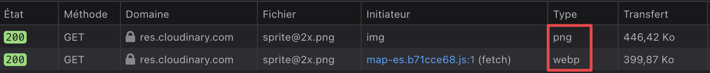

It looks like when I preload an image on #Cloudinary, the automatic best format selection (`f_auto`) doesn't work! 😱

These two requests have [the exact same URL](https://res.cloudinary.com/nho/image/fetch/q_auto,f_auto/https://nicolas-hoizey.photo/ui/thumbnails/612229/sprite@2x.png):

