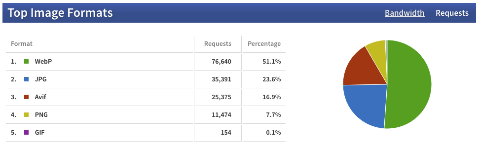
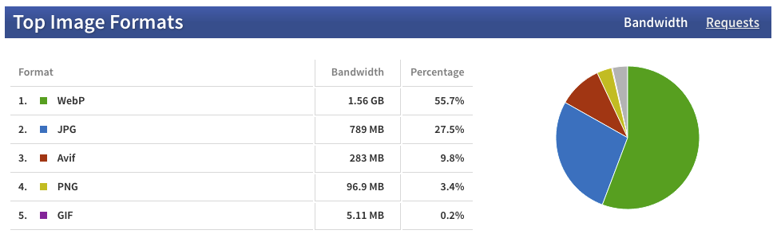

[One year later](), interesting update about image formats used on my sites:

16.9 % of the requests made for images on my web sites are served as AVIF by #Cloudinary:

But it only represents 9.8 % of the bandwidth! 😍

Still looking forward to seeing JPEG XL there… 😁
