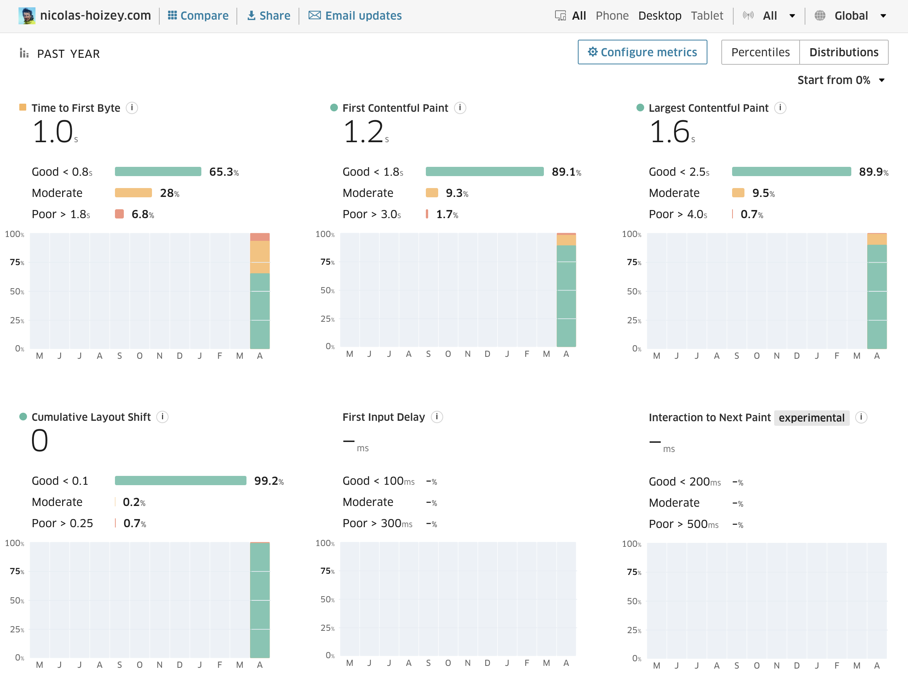

It looks like after [a few month without enough trafic](), my personal site is back in [**C**h**r**ome **U**ser e**X**perience](https://developers.google.com/web/tools/chrome-user-experience-report)! 🎉

Thanks #Treo for [the great UI to check these data](https://treo.sh/sitespeed/nicolas-hoizey.com?metricsMode=d):

