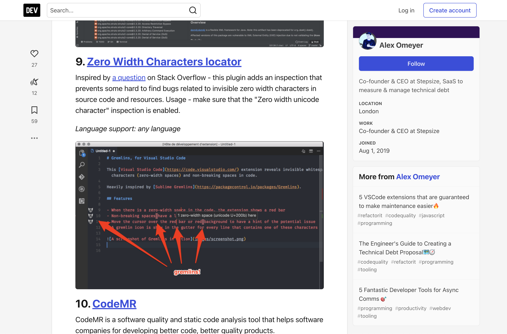

Did @StepsizeHQ use a screenshot of my own [Gremlins extension](https://marketplace.visualstudio.com/items?itemName=nhoizey.gremlins) for #VSCode to [illustrate a similar extension but made for JetBrains](https://dev.to/alexomeyer/10-jetbrains-extensions-to-fight-technical-debt-5gg6#9-zero-width-characters-locator)?

Looks like he did… 😅
