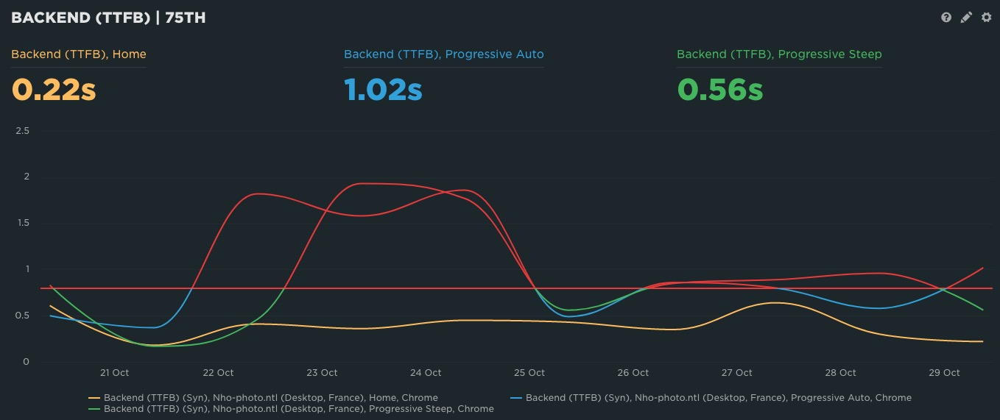

Any idea why there's so much TTFB difference on #Netlify for main vs branch deploys?

Here is TTFB for:
- Orange: https://nho-photo.netlify.app/
- Blue: https://progressive--nho-photo.netlify.app/
- Green: https://progressive-steep--nho-photo.netlify.app/

