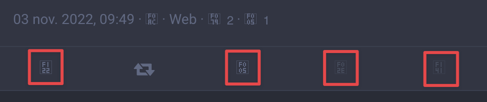
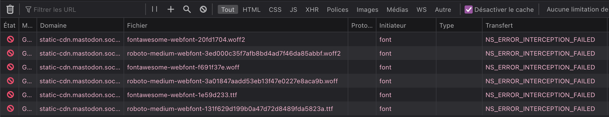

Do we really need to repeat that [using an icons font is a bad idea]()?

This is #Mastodon UI right now:

Fonts are not loaded because of an error (from a Service Worker?):

Very welcoming for new Mastodon users… 😔
