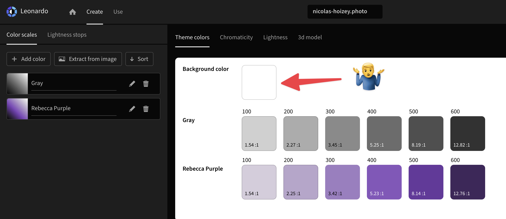

I'm trying to use #Leonardo to create a real set of design tokens for the colors I currently use on https://nicolas-hoizey.photo but I didn't find how to set the background color to `#292929` instead of white… 🤷‍♂️

https://leonardocolor.io/theme.html?name=nicolas-hoizey.photo&config=%7B%22baseScale%22%3A%22Gray%22%2C%22colorScales%22%3A%5B%7B%22name%22%3A%22Gray%22%2C%22colorKeys%22%3A%5B%22%23000000%22%5D%2C%22colorspace%22%3A%22RGB%22%2C%22ratios%22%3A%5B%221.45%22%2C%222.05%22%2C%223.03%22%2C%224.54%22%2C%227%22%2C%2210.86%22%5D%2C%22smooth%22%3Afalse%7D%2C%7B%22name%22%3A%22Rebecca+Purple%22%2C%22colorKeys%22%3A%5B%22%23663399%22%5D%2C%22colorspace%22%3A%22HSL%22%2C%22ratios%22%3A%5B%221.45%22%2C%222.05%22%2C%223.03%22%2C%224.54%22%2C%227%22%2C%2210.86%22%5D%2C%22smooth%22%3Atrue%7D%5D%2C%22lightness%22%3A100%2C%22contrast%22%3A1.19%2C%22saturation%22%3A100%2C%22formula%22%3A%22wcag2%22%7D
