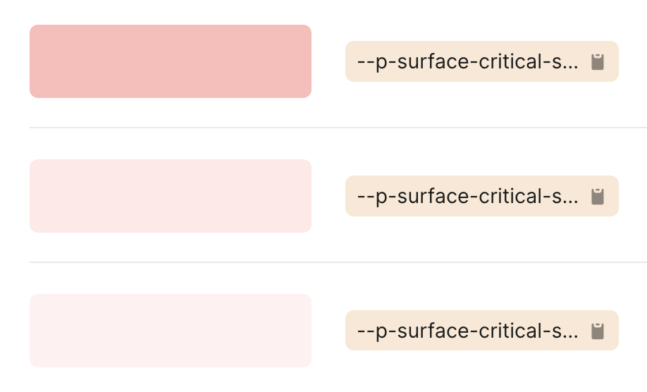

When we say "[truncation is not a content strategy](https://www.slideshare.net/KMcGrane/developing-successful-content-management-solutions)", it's true also for design tokens names!

I saw this is [Shopify's Polaris Design System](https://polaris.shopify.com/tokens/colors)… 🤷‍♂️
