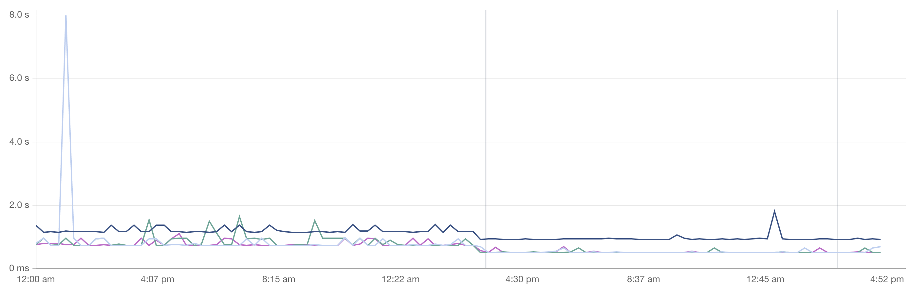
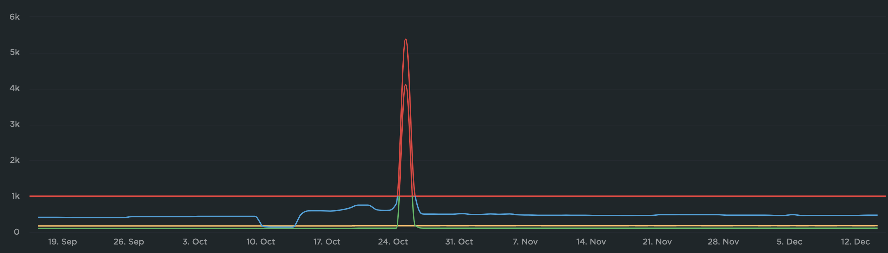

In all #WebPerf reporting tools with graphs, I would like to be able to quickly set a preferred scale, or ignore certain values that I know are incorrect.

Examples from Contentsquare/Dareboost and SpeedCurve…

