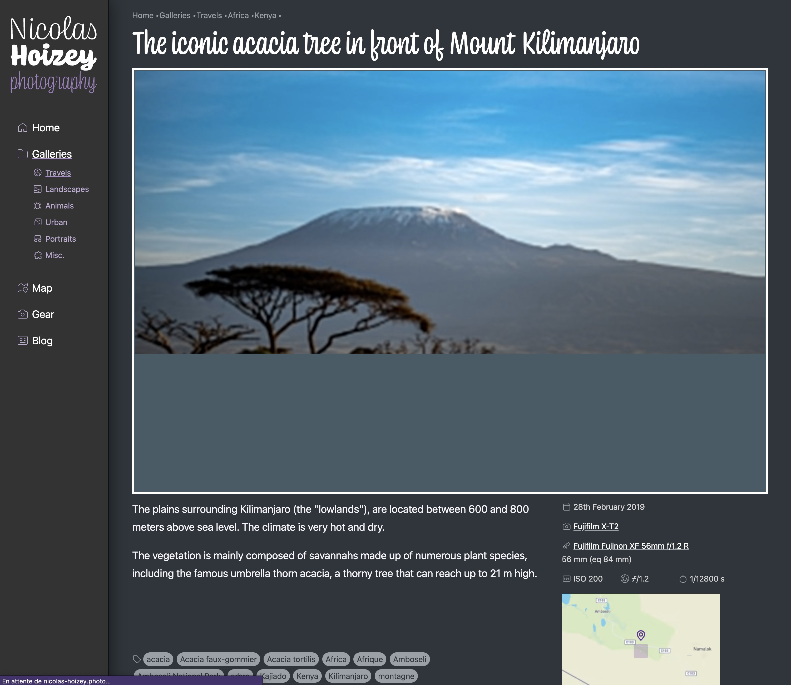

Large photos in photo pages of [my photography site](https://nicolas-hoizey.photo) are now progressive JPEGs so that you can see them earlier, even if they weight more than with AVIF or WebP:

Thanks to [Cloudinary](https://cloudinary.com/blog/progressive_jpegs_and_green_martians#want_to_give_it_a_try_) and [my responsive images plugin for Eleventy](https://nhoizey.github.io/images-responsiver/eleventy-plugin-images-responsiver/), it took me [10 seconds](https://github.com/nhoizey/nicolas-hoizey.photo/commit/ae64a5cdc5989d600ac70eefc8e26d3c9ff5a2f0)! 😍

I wish Google didn't kill JPEG-XL… 😭

I also wish Largest Contenful Paint didn't wait for the full progressive image to be downloaded and rendered.
