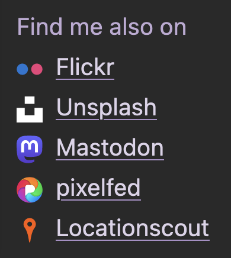
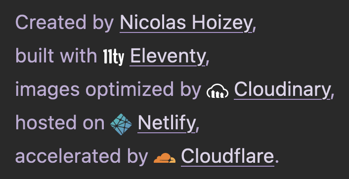

I updated the footer on <https://nicolas-hoizey.photo/> with nice icons for the other platforms where I publish photos, and the services I use to build and deploy the site.

Some where hard to find, most were not optimized (thanks [SGVOMG](https://jakearchibald.github.io/svgomg/)!).

The Pixelfed one is reaaaaaly heavy with all these gradients, masks and paths.