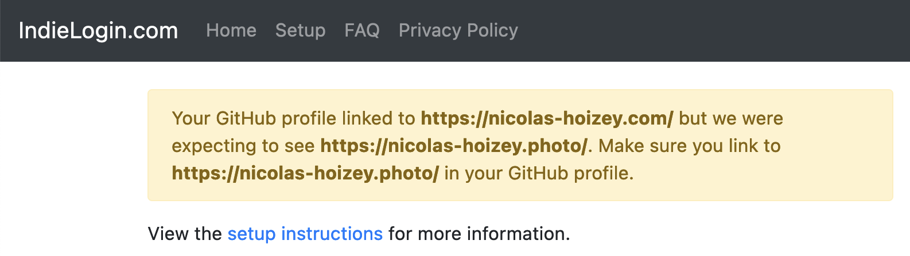

Confused about IndieAuth with multiple domains: <https://indielogin.com/setup#multiple-domains>

> If you have multiple domains, or want your Twitter URL to link to something that is not your main website, you can alternatively put one or more URLs in your "bio" field on Twitter and GitHub. This allows you to use one Twitter account to authenticate multiple domains.

GitHub is mentioned for the bio part, but it doesn't work with a link to GitHub on my second domain:

I don't want to use Twitter anymore… 😞
