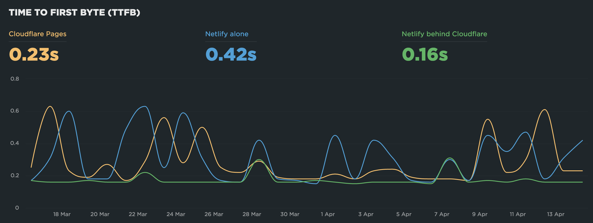

I still don't understand why using Cloudflare in front of Netlify allows for a much better and stable Time To First Byte (TTFB) than Cloudflare Pages or Netlify alone… 🤷‍♂️

{.twothirds}

TTFB for static sites should always be very low.