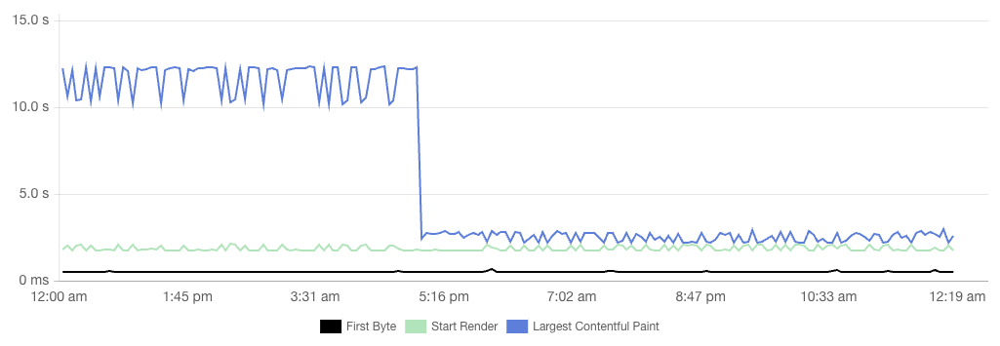

Limiting the image density on mobile devices drasticaly improves performance, with no visual loss, so we did it!

I still wish it was much easier than dealing with `<picture>` and `x` descriptors for fluid images… 😞

With a `` attribute for example!

If you agree, comment:
https://github.com/whatwg/html/issues/4421
