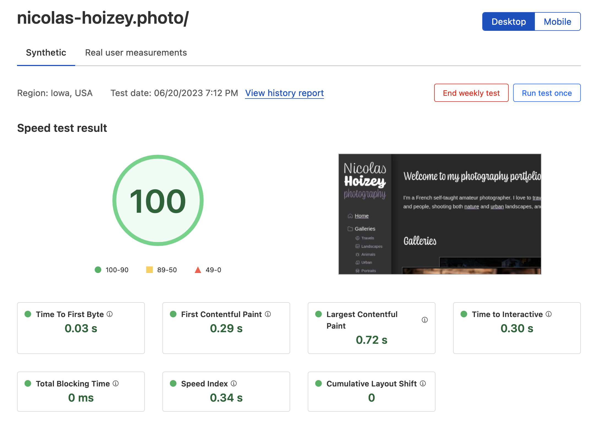

Cloudflare in “[Faster website, more customers: Cloudflare Observatory can help your business grow](https://blog.cloudflare.com/cloudflare-observatory-generally-available/)”:

> The generated report provides an overall performance score ranging from 1 (least performant) to <mark>99 (most performant)</mark>

First try on [my photography site](https://nicolas-hoizey.photo): **100** 🤷‍♂️😅

Joke aside, new tools to audit performance are always welcome!