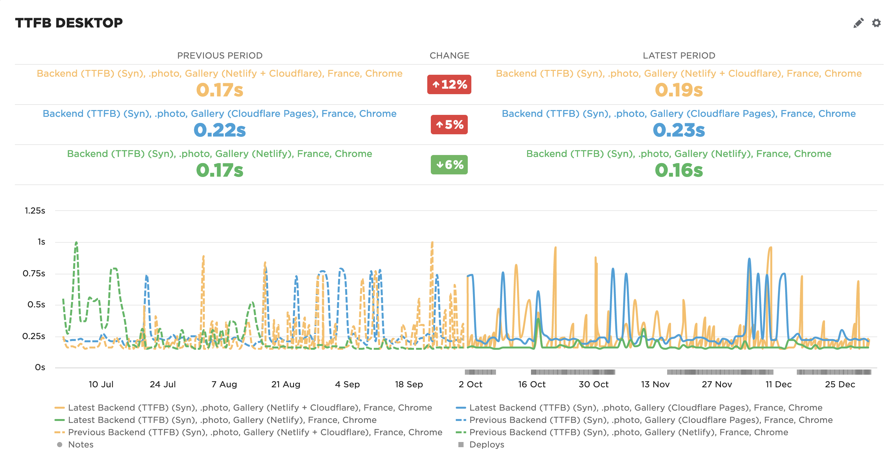

Judging by this #SpeedCurve graph comparing TTFB from last 3 months to the 3 months before, it looks like TTFB has improved lately with #Netlify, while it has degraded with #Cloudflare:

I'm currently using Cloudflare in front of Netlify, but I'm not sure it's worth it anymore. 🤔